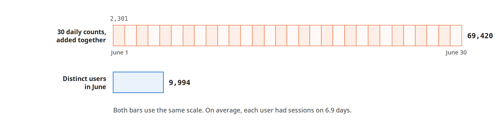

# Metric Views in Apache Spark 4.2: How They Work and How to Use Them

A metric view is a view whose definition names dimensions and measures instead of a fixed query.
Each measure is an aggregate expression written without a grouping, and a query supplies the grouping
when it asks for the measure with `MEASURE()`. This post covers why Spark added metric views, how to
define and query one, what a metric view does and does not guard against, and the rules Apache Spark
4.2.0 applies to definitions, queries and catalog commands. It is written for data engineers and
analysts who write Spark SQL and maintain metric definitions that other people query. Every claim is
cited.

> Verified against Apache Spark **4.2.0** (released 2026-07-14) on 2026-09-11: an official
> `apache/spark:4.2.0-scala2.13-java21-python3-ubuntu` Spark Connect server driven by
> `pyspark-client==4.2.0`, and a local Spark Classic session from `pyspark==4.2.0`.

Claims in this post carry one of four levels of provenance:

- **Unmarked**: reproduced against Spark 4.2.0 with the examples in this project or with
  `grammar_probe/probe.py`. Results, error conditions and accepted or rejected statements are in this
  category.
- **Per the source**: read from the Spark source at tag `v4.2.0` and cited with a link, but not
  exercised here.
- **Per the documentation**: taken from project documentation, a JIRA issue or a mailing-list
  message, and cited.
- **Untested here**: a configuration that was not available for testing, such as a Data Source V2
  catalog or a Hive metastore.

---

## Table of Contents

1. [Why Metric Views Exist](#1-why-metric-views-exist)
2. [The Demonstration Dataset](#2-the-demonstration-dataset)
3. [Two Aggregation Errors](#3-two-aggregation-errors)
4. [Defining a Metric View](#4-defining-a-metric-view)
5. [Querying with MEASURE()](#5-querying-with-measure)
6. [What a Metric View Does Not Prevent](#6-what-a-metric-view-does-not-prevent)
7. [Definition Rules and Lifecycle](#7-definition-rules-and-lifecycle)
8. [Modeling the Source](#8-modeling-the-source)
9. [Metric Views and Other Semantic Layers](#9-metric-views-and-other-semantic-layers)
10. [Running the Examples](#10-running-the-examples)
11. [Scope of This Post](#11-scope-of-this-post)

---

## 1. Why Metric Views Exist

This section describes the kind of measure that metric views are designed for, where definitions of
such measures have usually been kept, and the proposal that added metric views to Spark. Readers who
are familiar with the background can skip to §2.

### Additive and Non-Additive Measures

Dimensional modeling sorts the numeric measures of a fact table by how they combine. The Kimball
Group summarizes the categories:

> The numeric measures in a fact table fall into three categories. The most flexible and useful
> facts are fully additive; additive measures can be summed across any of the dimensions associated
> with the fact table. Semi-additive measures can be summed across some dimensions, but not all;
> balance amounts are common semi-additive facts because they are additive across all dimensions
> except time. Finally, some measures are completely non-additive, such as ratios.

Revenue is additive: the revenue of a month is the sum of the revenue of its days. A conversion
rate, the share of sessions that led to an order, is a ratio, and the rate for a month is neither the
sum nor the average of the daily rates. A count of distinct users is also non-additive: a user who
was active on several days is one user in the month, but appears in the count for every one of those
days.

For ratios, the same page recommends keeping the additive parts:

> A good approach for non-additive facts is, where possible, to store the fully additive components
> of the non-additive measure and sum these components into the final answer set before calculating
> the final non-additive fact.

A conversion rate is then computed as converted sessions divided by sessions, at whatever grain the
question needs. A distinct count has no additive components, so it has to be recomputed from the
detail rows at each grain. In both cases the correct formula is known when the metric is defined, but
it has to be applied each time a query is written.

### Where Metric Definitions Have Lived

The SPIP that proposed metric views describes the usual practice in Spark:

> Today, users create many SQL views: one view for "active users by month," another for "active
> users by region," and so on. These standard views are typically designed to answer a specific
> business question. They often include aggregation logic and dimension groupings that must be
> specified when the view is created. This can cause issues when a user wants to query a dimension
> not included in the original view. More complex measures, such as ratios or distinct counts, often
> cannot be re-aggregated without returning incorrect results.

Semantic layers in business intelligence and transformation tools address the same problem outside
the query engine. Per the Looker documentation, LookML "is the language that is used in Looker to
create semantic data models", and "Looker uses a model that is written in LookML to construct SQL
queries against a particular database." Per the dbt documentation, the dbt Semantic Layer is
"powered by MetricFlow", centralizes metric definitions in a dbt project, and "MetricFlow handles SQL
query construction". In both, the definitions live in a tool that generates SQL, and a query written
directly against the tables does not use them.

The SPIP lists what it sees as the costs of keeping definitions in many views:

> Using many SQL views instead of a metric-specific construct leads to:
>
> - Duplicate logic and copy-paste errors.
> - Wrong answers when people re-aggregate ratios or distinct counts.
> - Join drift: each view chooses its own join path and filters.
> - Governance sprawl: it's hard to see who owns the "official" version of a metric and what it
>   depends on.
> - Client-side semantic layers help, but live outside the engine, so the optimizer and permissions
>   can't enforce correctness.

### The Proposal

On October 31, 2025, Linhong Liu proposed "The metrics & semantic modeling in Spark" on the
dev@spark.apache.org mailing list:

> This feature enables defining business metrics once and reusing them across any breakdown,
> ensuring consistent outcomes and bridging the semantic gap between business logic and data schemas
> to help LLMs generate more precise results.

The linked SPIP document lists Can Efeoglu, Justin Talbot, Linhong Liu, Gengliang Wang, Liang-Chi
Hsieh and Daniel Tenedorio as authors and Wenchen Fan as shepherd. It states the objective:

> We want a simple way for people to define important business metrics (like "active users,"
> "revenue," or "revenue per customer") once and then ask for those metrics by any breakdown (by
> date, by country, by product) and always get the same, correct answer. We propose adding a view
> type to Spark called a metric view.

In the discussion, Wenchen Fan gave the case for a dedicated construct:

> I believe this is a very useful feature, as the other alternatives do not work well: people need
> to either define many similar views with different grouping columns and aggregate functions, or
> manually maintain a doc page to describe the semantic of these metrics that people need to follow
> when writing queries to calculate these metrics.

The vote opened on November 10, 2025, and passed on November 13 with 19 +1 votes, 5 of them binding,
and no -1 votes. The work was tracked as SPARK-54119, "Metrics & semantic modeling in Spark". The
SPIP document can still be edited; the quotations above are as fetched on 2026-09-11, with reviewer
comment markers removed.

### The Design Decision

A metric view is stored in the catalog as a view, but its definition is a YAML document rather than a
query. The document names a source relation, dimensions and measures. A dimension is an expression
over the source's columns that a query can group or filter by. A measure is an aggregate expression,
such as `SUM(CAST(converted AS INT)) / COUNT(1)`, written without a grouping. In the SPIP's words,
"Metric views allow authors to define measures and dimensions independently of how users filter and
group the data."

A query asks for a measure with `MEASURE()` and supplies the grouping with an ordinary `GROUP BY`.
Per the source, `MEASURE()` is an aggregate function that is never evaluated: the analyzer replaces it
with the measure's expression, and the aggregation then runs over the source at the query's grain
(§5). The author of a metric writes its formula once, and every query evaluates that formula at its
own grain.

### Development in Spark 4.2

*Table 1-1. Metric view milestones*

| Date | Milestone | Reference |
|---|---|---|
| 2025-10-31 | SPIP proposed on dev@spark.apache.org | [DISCUSS thread](https://lists.apache.org/thread/vdr5wgtccs33wvrbdmroz3wtslqh8s9d) |
| 2025-11-13 | Vote passes with 19 +1 votes, 5 binding, and no -1 votes | [Vote result](https://www.mail-archive.com/dev@spark.apache.org/msg34518.html) |
| 2025-12-10 | Parsing of metric view YAML committed | [SPARK-54403](https://issues.apache.org/jira/browse/SPARK-54403), [PR 53146](https://github.com/apache/spark/pull/53146) |
| 2025-12-17 | `CREATE VIEW ... WITH METRICS` and query resolution committed | [SPARK-54405](https://issues.apache.org/jira/browse/SPARK-54405), [PR 53158](https://github.com/apache/spark/pull/53158) |
| 2026-05-07 | Metric view creation on Data Source V2 catalogs committed | [SPARK-56920](https://issues.apache.org/jira/browse/SPARK-56920), [PR 55487](https://github.com/apache/spark/pull/55487) |
| 2026-05-25 | SPARK-54119 resolved with fix version 4.2.0 | [SPARK-54119](https://issues.apache.org/jira/browse/SPARK-54119) |
| 2026-07-14 | Apache Spark 4.2.0 released | [Release notes](https://spark.apache.org/releases/spark-release-4-2-0.html) |

The 4.2.0 release notes list metric views among the release highlights. SPARK-54408, "Metric view
Composability", covers a metric view used as the source of another and measures that refer to other
measures; it is open with no fix version. As of 2026-09-11, the Spark 4.2.0 documentation has no
page on metric views. The SQL function reference has an entry for `measure`: "this function is used
and can only be used to calculate a measure defined in a metric view."

**Citations:** [Kimball Group, "Additive, Semi-Additive, and Non-Additive Facts"](https://www.kimballgroup.com/data-warehouse-business-intelligence-resources/kimball-techniques/dimensional-modeling-techniques/additive-semi-additive-non-additive-fact/), [SPIP: Metrics & semantic modeling in Spark](https://docs.google.com/document/d/1xVTLijvDTJ90lZ_ujwzf9HvBJgWg0mY6cYM44Fcghl0/edit), [DISCUSS thread](https://lists.apache.org/thread/vdr5wgtccs33wvrbdmroz3wtslqh8s9d), [Wenchen Fan's reply](https://www.mail-archive.com/dev@spark.apache.org/msg34480.html), [VOTE thread](https://lists.apache.org/thread/hgwl05p10f71gtfx3ncw6rhbnkj5wfol), [What is LookML?](https://cloud.google.com/looker/docs/what-is-lookml), [dbt Semantic Layer](https://docs.getdbt.com/docs/use-dbt-semantic-layer/dbt-sl), [About MetricFlow](https://docs.getdbt.com/docs/build/about-metricflow), [SPARK-54408](https://issues.apache.org/jira/browse/SPARK-54408), [Measure.scala](https://github.com/apache/spark/blob/v4.2.0/sql/catalyst/src/main/scala/org/apache/spark/sql/catalyst/expressions/aggregate/Measure.scala#L26-L60), [`measure` function reference](https://spark.apache.org/docs/4.2.0/api/sql/agg-functions/#measure), [Spark news: Spark 4.2.0 released](https://spark.apache.org/news/index.html)

---

## 2. The Demonstration Dataset

This section describes the data that every example uses and how the examples reach it.

`tools/generate_data.py` writes three Parquet files for one month, June 2026, of a food-delivery
service. It uses numpy with a fixed seed, so every run writes the same rows, and it does not need
Spark.

*Table 2-1. Tables*

| Table | Rows | Columns |
|---|---|---|
| `users` | 10,000 | `user_id`, `home_region` |
| `sessions` | 79,000 | `session_id`, `user_id`, `region`, `session_date`, `converted` |
| `orders` | 7,295 | `order_id`, `session_id`, `user_id`, `region`, `order_date`, `order_total` |

Each session belongs to one of five regions and either led to an order (`converted` is true) or did
not, and each converted session has one order. Two properties of the data make the errors in §3
visible. The regions differ in size by a factor of 250, and the generator gives the smaller regions
higher conversion probabilities. And each session draws its user from the residents of its region,
so users return on several days.

*Table 2-2. Sessions by region*

| Region | Sessions | Converted | Conversion rate |
|---|---|---|---|
| metro | 50,000 | 3,937 | 0.0787 |
| urban | 20,000 | 1,979 | 0.0990 |
| suburban | 8,000 | 974 | 0.1218 |
| rural | 800 | 302 | 0.3775 |
| remote | 200 | 103 | 0.5150 |

The examples run against a Spark Connect server started from `compose.yaml` with the official Spark
4.2.0 image, and the Parquet files are mounted read-only into the server at `/demo/data`. Each example
registers the files it needs as external tables:

```sql
CREATE TABLE IF NOT EXISTS sessions USING parquet LOCATION '/demo/data/sessions.parquet'
```

An external table is persistent, which a metric view's source must be (§7), and Spark reads its
files in place. The server uses Spark's in-memory catalog, so tables and views last until the server
stops. §10 lists the commands that run everything.

**Citations:** `tools/generate_data.py`, `compose.yaml`, `examples/01_average_of_ratios.py`

---

## 3. Two Aggregation Errors

This section shows two queries that answer a different question from the one they appear to answer.
Both run without an error or a warning. Examples 01 and 02 run them.

### Averaging Ratios

A report needs one conversion rate for the month. The regional rates in Table 2-2 are at hand, and
averaging them is the shortest query. Example 01 computes that average next to the rate computed
from the totals:

```sql
SELECT ROUND(AVG(conversion_rate), 4) AS average_of_region_rates,
       ROUND(SUM(converted) / SUM(sessions), 4) AS converted_over_sessions,
       ROUND(AVG(conversion_rate) / (SUM(converted) / SUM(sessions)), 1) AS ratio
FROM (
    SELECT region,
           COUNT(*) AS sessions,
           SUM(CAST(converted AS INT)) AS converted,
           AVG(CAST(converted AS DOUBLE)) AS conversion_rate
    FROM sessions
    GROUP BY region
)
```

```
+-----------------------+-----------------------+-----+
|average_of_region_rates|converted_over_sessions|ratio|
+-----------------------+-----------------------+-----+
|                 0.2384|                 0.0923|  2.6|
+-----------------------+-----------------------+-----+
```

Of the 79,000 sessions, 7,295 converted, so the month's conversion rate is 0.0923, or 9.2%. The
average of the five regional rates is 0.2384, or 23.8%, 2.6 times as high. The average gives each
region the same weight, so the 200 sessions of the remote region count as much as the 50,000 sessions
of the metro region. Dividing the totals weights each region by its sessions, which is what a rate
for the month means. The two methods agree only when every region has the same number of sessions.
Figure 3-1 shows the difference.


*Figure 3-1. The unweighted average of the regional rates and the rate computed from the totals*

### Summing Distinct Counts

A report needs the number of users who were active in the month, and a table of daily active users
is at hand. Example 02 shows the first days of that table:

```
+------------+------------+
|session_date|active_users|
+------------+------------+
|  2026-06-01|        2301|
|  2026-06-02|        2328|
|  2026-06-03|        2308|
|  2026-06-04|        2340|
|  2026-06-05|        2286|
+------------+------------+
only showing top 5 rows
```

It then sums the daily counts and compares the sum with a distinct count over the month:

```sql
WITH daily AS (
    SELECT session_date, COUNT(DISTINCT user_id) AS active_users
    FROM sessions
    GROUP BY session_date
)
SELECT (SELECT SUM(active_users) FROM daily) AS sum_of_daily_active_users,
       (SELECT COUNT(DISTINCT user_id) FROM sessions) AS monthly_active_users,
       (SELECT COUNT(*) FROM users) AS users
```

```
+-------------------------+--------------------+-----+
|sum_of_daily_active_users|monthly_active_users|users|
+-------------------------+--------------------+-----+
|                    69420|                9994|10000|
+-------------------------+--------------------+-----+
```

The sum of the daily counts is 69,420, more than the 10,000 users in the `users` table. The distinct
count for the month is 9,994. A user with sessions on seven days appears in seven daily counts. On
average, each of the 9,994 users had sessions on 6.9 days, so the sum is 6.9 times the month's count.
Each daily count is correct for its day, and nothing in the table of daily counts says that they
cannot be added. Figure 3-2 draws the thirty daily counts to the same scale as the month's count.



*Figure 3-2. Daily distinct users added together, and distinct users for the month*

### Why Both Queries Run

Both queries are valid SQL, and nothing in them tells Spark that the author wanted a rate for the
month or a count of distinct users. The correct formula depends on the grain of the question, and
whoever writes the query has to supply it. A metric view moves the formula into a definition that
every query shares.

**Citations:** `examples/01_average_of_ratios.py`, `examples/02_summing_distinct_counts.py`

---

## 4. Defining a Metric View

This section covers the statement that creates a metric view, the YAML document inside it, and what
Spark records in the catalog. Example 03 creates the view that §5 and §6 query.

### The CREATE VIEW Statement

Example 03 creates the view with this statement, where the body between the `$$` markers is the YAML
document in the next subsection:

```sql
CREATE VIEW delivery_metrics WITH METRICS LANGUAGE YAML AS $$ ... $$
```

Per the source, the grammar rule at tag `v4.2.0` is:

```antlr
| CREATE (OR REPLACE)?
    VIEW (IF errorCapturingNot EXISTS)? identifierReference
    identifierCommentList?
    ((WITH METRICS) |
     routineLanguage |
     commentSpec |
     (TBLPROPERTIES propertyList))*
    AS codeLiteral                                                 #createMetricView
```

`WITH METRICS` distinguishes a metric view from an ordinary view, and `LANGUAGE YAML` names the
language of the body. Per the source, both clauses are required, and YAML is the only language the
parser accepts. The body is a dollar-quoted string (`codeLiteral`); a single-quoted string in its
place failed to parse. `COMMENT` and `TBLPROPERTIES` are accepted. There is no temporary form:
`CREATE TEMPORARY VIEW ... WITH METRICS` failed with `PARSE_SYNTAX_ERROR`.

### The YAML Document

```yaml
version: 0.1
source: sessions
dimensions:
  - name: region
    expr: region
  - name: session_date
    expr: session_date
measures:
  - name: total_sessions
    expr: COUNT(1)
  - name: converted_sessions
    expr: SUM(CAST(converted AS INT))
  - name: conversion_rate
    expr: SUM(CAST(converted AS INT)) / COUNT(1)
  - name: active_users
    expr: COUNT(DISTINCT user_id)
```

The definition has two dimensions, which a query can group by, and four measures. `conversion_rate`
is converted sessions divided by sessions, the formula §3 arrived at, and `active_users` is a
distinct count of users. Neither holds a precomputed value: each is evaluated when a query asks for
it, at the query's grain. Figure 4-1 labels the parts of the statement and the document.


*Figure 4-1. The parts of a metric view definition*

*Table 4-1. Fields of a metric view definition in Spark 4.2.0*

| Field | Required | Content | Observed on 4.2.0 |
|---|---|---|---|
| `version` | Yes | The version of the definition format | Only `0.1` is accepted. `1.0`, `1.1` or no version fails with `INVALID_METRIC_VIEW_YAML`. |
| `source` | Yes | A table or view name, or a SQL query | No source fails with `INVALID_METRIC_VIEW_YAML`. A temporary view fails with `INVALID_TEMP_OBJ_REFERENCE`. |
| `filter` | No | A boolean expression applied to every query | Used in §8. |
| `dimensions` | No | A list of columns, each with `name` and `expr` | A definition without dimensions was accepted. |
| `measures` | No | A list of columns, each with `name` and an aggregate `expr` | A definition without measures was accepted. A measure without an aggregate function fails with `MISSING_AGGREGATION`. |

Any other key fails, and the error message lists the keys the parser knows. For a `fields` key:

```
[INVALID_METRIC_VIEW_YAML] Failed to parse metric view YAML: Failed to parse YAML: Unrecognized field
"fields" (class org.apache.spark.sql.metricview.serde.MetricViewV01), not marked as ignorable
(5 known properties: "version", "source", "dimensions", "filter", "measures")
```

A dimension or a measure accepts only `name` and `expr`; `display_name`, `comment`, `synonyms`,
`format` and `window` fail in the same way. Per the source, Spark first tries to parse the `source`
string as a table name and, if that fails, as a query; §8 uses a query that joins two tables.

### What Spark Records

Example 03 then describes the view:

```
Columns of delivery_metrics
+------------------+---------+-------+
|          col_name|data_type|comment|
+------------------+---------+-------+
|            region|   string|   NULL|
|      session_date|   string|   NULL|
|    total_sessions|   bigint|   NULL|
|converted_sessions|   bigint|   NULL|
|   conversion_rate|   double|   NULL|
|      active_users|   bigint|   NULL|
+------------------+---------+-------+

Catalog entry
+----------------+-------------------------------------------------------------+-------+
|col_name        |data_type                                                    |comment|
+----------------+-------------------------------------------------------------+-------+
|Type            |METRIC_VIEW                                                  |       |
|Language        |YAML                                                         |       |
|Table Properties|[metric_view.from.name=sessions, metric_view.from.type=ASSET]|       |
+----------------+-------------------------------------------------------------+-------+
```

The dimensions and measures are the view's columns. Per the source, Spark derives their types when
the view is created, by planning an aggregation grouped by every dimension, which is why the counts
are `bigint` and the rate is `double`. The table type is `METRIC_VIEW`, and the table properties
record the source. `DESCRIBE TABLE EXTENDED` also returns the YAML document in its `View Text` row,
which is how to read a definition back (§7). The catalog API reports the type differently:
`spark.catalog.listTables()` listed a metric view with table type `VIEW`.

**Citations:** `examples/03_create_metric_view.py`, [SqlBaseParser.g4](https://github.com/apache/spark/blob/v4.2.0/sql/api/src/main/antlr4/org/apache/spark/sql/catalyst/parser/SqlBaseParser.g4#L330-L337), [SparkSqlParser.scala](https://github.com/apache/spark/blob/v4.2.0/sql/core/src/main/scala/org/apache/spark/sql/execution/SparkSqlParser.scala#L827-L876), [MetricViewSerDeV01.scala](https://github.com/apache/spark/blob/v4.2.0/sql/catalyst/src/main/scala/org/apache/spark/sql/metricview/serde/MetricViewSerDeV01.scala#L22-L46), [MetricViewCanonical.scala](https://github.com/apache/spark/blob/v4.2.0/sql/catalyst/src/main/scala/org/apache/spark/sql/metricview/serde/MetricViewCanonical.scala#L92-L110), [ResolveMetricView.scala](https://github.com/apache/spark/blob/v4.2.0/sql/core/src/main/scala/org/apache/spark/sql/catalyst/analysis/ResolveMetricView.scala#L175-L183), `grammar_probe/results/connect-1.json`

---

## 5. Querying with MEASURE()

This section runs queries against the metric view at three grains, explains how Spark resolves
`MEASURE()`, and lists the filtering, grouping and ordering clauses a query can use. Example 04 runs
the queries.

### One Definition at Every Grain

Without a `GROUP BY`, a query evaluates each measure over the whole source:

```sql
SELECT ROUND(MEASURE(conversion_rate), 4) AS conversion_rate,
       MEASURE(active_users) AS active_users,
       MEASURE(total_sessions) AS sessions
FROM delivery_metrics
```

```
+---------------+------------+--------+
|conversion_rate|active_users|sessions|
+---------------+------------+--------+
|         0.0923|        9994|   79000|
+---------------+------------+--------+
```

The rate is the 0.0923 that §3 computed from the totals, and the user count is the month's distinct
count, 9,994. Grouping by a dimension evaluates the same measures once for each region:

```sql
SELECT region,
       MEASURE(total_sessions) AS sessions,
       ROUND(MEASURE(conversion_rate), 4) AS conversion_rate,
       MEASURE(active_users) AS active_users
FROM delivery_metrics
GROUP BY region
ORDER BY sessions DESC
```

```
+--------+--------+---------------+------------+
|  region|sessions|conversion_rate|active_users|
+--------+--------+---------------+------------+
|   metro|   50000|         0.0787|        6370|
|   urban|   20000|          0.099|        2519|
|suburban|    8000|         0.1218|         974|
|   rural|     800|         0.3775|          99|
|  remote|     200|          0.515|          32|
+--------+--------+---------------+------------+
```

The rates match Table 2-2. Grouping by day evaluates them once for each day:

```sql
SELECT session_date,
       MEASURE(active_users) AS active_users,
       ROUND(MEASURE(conversion_rate), 4) AS conversion_rate
FROM delivery_metrics
GROUP BY session_date
ORDER BY session_date
```

```
+------------+------------+---------------+
|session_date|active_users|conversion_rate|
+------------+------------+---------------+
|  2026-06-01|        2301|         0.0952|
|  2026-06-02|        2328|         0.0889|
|  2026-06-03|        2308|         0.0893|
|  2026-06-04|        2340|          0.093|
|  2026-06-05|        2286|          0.089|
+------------+------------+---------------+
only showing top 5 rows
```

Each day's `active_users` is that day's distinct count, as in example 02. `tests/spark/test_metric_views.py`
compares these results with aggregates written by hand over `sessions`, at the whole-source, region
and day grains, on both Spark Classic and Spark Connect, and they are equal.

### How MEASURE() Is Resolved

Per the source, `measure` is declared as an aggregate function that cannot be evaluated. A comment in
its definition explains its role: "This function serves as an annotation to tell the analyzer to
calculate the measures defined in metric views. It cannot be evaluated in execution phase and instead
it'll be replaced to the actual aggregate functions defined by the measure". The analyzer rule
`ResolveMetricView` builds a plan from the definition, in which the source relation or query, with the
`filter` applied, supplies each dimension's expression. In the query's aggregation, the rule replaces
each `MEASURE(name)` with that measure's aggregate expression. The aggregation that runs is the one a
careful author would have written by hand, at the query's grain. Figure 5-1 follows one query.


*Figure 5-1. How the analyzer resolves MEASURE() for one query*

Two failures follow from this design. `MEASURE()` over an ordinary table has no measure to
substitute: `SELECT MEASURE(converted) FROM sessions` failed with `INTERNAL_ERROR`. And a measure is
not a column that holds values, so a query that selects a measure without `MEASURE()`, or selects
`*`, has nothing to read; both failed with `INTERNAL_ERROR` (§7).

### Filtering, Grouping and Ordering

Table 5-1 lists the query clauses that `grammar_probe/probe.py` tested against a metric view.

*Table 5-1. Query clauses on a metric view in Spark 4.2.0*

| Clause | Result |
|---|---|
| `WHERE` on a dimension | Accepted; `WHERE region = 'metro'` returned 50,000 sessions |
| `WHERE` on a source column that is not a dimension | Accepted; `WHERE converted` returned 7,295 sessions |
| `WHERE` with `MEASURE()` | `MISSING_ATTRIBUTES.RESOLVED_ATTRIBUTE_MISSING_FROM_INPUT` |
| A source column that is not a dimension, in `SELECT` or `GROUP BY` | `UNRESOLVED_COLUMN.WITH_SUGGESTION` |
| A dimension in `SELECT` without `GROUP BY` | `MISSING_GROUP_BY` |
| `GROUP BY ALL` | Accepted |
| `HAVING` with the measure's alias | Accepted |
| `HAVING` with `MEASURE()` | `UNRESOLVED_COLUMN.WITH_SUGGESTION` |
| `ORDER BY` the measure's alias or its position | Accepted |
| `ORDER BY` with `MEASURE()`, whether or not the measure is selected | `UNRESOLVED_COLUMN.WITH_SUGGESTION` |
| `ORDER BY` a grouped dimension that is not selected | Accepted |
| `LIMIT` | Accepted |
| `MEASURE()` inside an expression, such as `ROUND(MEASURE(conversion_rate) * 100, 1)` | Accepted |
| A common table expression over a metric view query | Accepted |
| `COUNT(*)` over the metric view | Accepted; returned 79,000, the rows of the source |
| A join with another relation on a dimension | `INTERNAL_ERROR` |

In practice, a query refers to a selected measure in `ORDER BY` and `HAVING` by its alias, and
filters rows with `WHERE`. Per the source, the analyzer's own documentation says that source columns
are hidden from a metric view; in the probe, a `WHERE` on a source column that is not a dimension was
accepted, while selecting or grouping by one was not.

### The DataFrame API

`MEASURE()` is available to the DataFrame API through SQL expressions. Against a metric view with the
same measures, both of these returned the same values as the equivalent SQL queries:

```python
from pyspark.sql import functions as F

metrics = spark.table("delivery_metrics")
metrics.groupBy("region").agg(F.expr("measure(total_sessions)").alias("sessions"))
metrics.selectExpr("round(measure(conversion_rate), 4)")
```

`metrics.columns` lists the dimensions and measures, and `metrics.count()` returned 79,000, the rows
of the source, as `COUNT(*)` does.

**Citations:** `examples/04_measure_at_every_grain.py`, `tests/spark/test_metric_views.py`, [Measure.scala](https://github.com/apache/spark/blob/v4.2.0/sql/catalyst/src/main/scala/org/apache/spark/sql/catalyst/expressions/aggregate/Measure.scala#L26-L60), [ResolveMetricView.scala](https://github.com/apache/spark/blob/v4.2.0/sql/core/src/main/scala/org/apache/spark/sql/catalyst/analysis/ResolveMetricView.scala#L141-L144), [ResolveMetricView.scala](https://github.com/apache/spark/blob/v4.2.0/sql/core/src/main/scala/org/apache/spark/sql/catalyst/analysis/ResolveMetricView.scala#L276-L287), `grammar_probe/results/connect-1.json`

---

## 6. What a Metric View Does Not Prevent

This section writes the two queries from §3 against the metric view. Example 05 runs them.

A metric view evaluates a measure at the grain of the query that uses it. It does not follow the
result into an enclosing query. The inner query below returns each day's distinct users correctly,
and the outer query sums them:

```sql
SELECT SUM(active_users) AS sum_of_daily_active_users
FROM (
    SELECT session_date, MEASURE(active_users) AS active_users
    FROM delivery_metrics
    GROUP BY session_date
)
```

```
+-------------------------+
|sum_of_daily_active_users|
+-------------------------+
|                    69420|
+-------------------------+
```

Averaging the regional rates behaves the same way:

```sql
SELECT ROUND(AVG(conversion_rate), 4) AS average_of_region_rates
FROM (
    SELECT region, MEASURE(conversion_rate) AS conversion_rate
    FROM delivery_metrics
    GROUP BY region
)
```

```
+-----------------------+
|average_of_region_rates|
+-----------------------+
|                 0.2384|
+-----------------------+
```

Both results are the ones §3 showed to be wrong for the month. To the outer query, the output of
`MEASURE()` is an ordinary column, and summing or averaging it is ordinary SQL. The definition format
also has no way to mark a measure as non-additive, because a column has only `name` and `expr`
(§4).

What a metric view provides is a single place for each formula: the author writes it once, and a
query at any grain evaluates it without restating it. A query that asks for a measure at the grain it
reports gets the correct value. A query that computes a measure at one grain and aggregates the
results to another reintroduces the error, whether the inner values came from a metric view or not.
Consumers of a metric view should therefore ask for each measure at the grain they report.

**Citations:** `examples/05_what_it_does_not_prevent.py`, [MetricViewSerDeV01.scala](https://github.com/apache/spark/blob/v4.2.0/sql/catalyst/src/main/scala/org/apache/spark/sql/metricview/serde/MetricViewSerDeV01.scala#L22-L25)

---

## 7. Definition Rules and Lifecycle

This section lists what Spark 4.2.0 accepts and rejects when a metric view is created, altered,
inspected and dropped. The results come from `grammar_probe/probe.py`, which runs 87 cases and
records, for every statement, the rows it returned or its error condition. Two runs over Spark
Connect produced identical results, and a run on Spark Classic accepted and rejected the same
statements with the same conditions. The recorded results are in `grammar_probe/results/`, and
examples 06 and 07 show a selection. Every case used the session catalog, `spark_catalog`, with
Spark's in-memory catalog implementation.

### Definitions

*Table 7-1. Metric view definitions*

| Definition | Result |
|---|---|
| `version: 1.0` or `version: 1.1` | `INVALID_METRIC_VIEW_YAML`, "Invalid YAML version" |
| No `version`, or no `source` | `INVALID_METRIC_VIEW_YAML` |
| Malformed YAML | `INVALID_METRIC_VIEW_YAML` |
| A top-level `joins`, `fields`, `comment` or `materialization` key | `INVALID_METRIC_VIEW_YAML`, "Unrecognized field" |
| `display_name`, `comment`, `synonyms`, `format` or `window` on a column | `INVALID_METRIC_VIEW_YAML`, "Unrecognized field" |
| No `dimensions`, or no `measures` | Accepted |
| A `filter` | Accepted, and applied to every query |
| A temporary view as the source | `INVALID_TEMP_OBJ_REFERENCE` |
| A qualified table name as the source | Accepted |
| A SQL query as the source, including one with a join | Accepted |
| A table created with `CREATE TABLE ... AS SELECT` as the source | Accepted |
| A metric view as the source | Created; querying it failed with `INTERNAL_ERROR` |
| A measure without an aggregate function | `MISSING_AGGREGATION` |
| A dimension that is an aggregate | `GROUP_BY_AGGREGATE` |
| A measure that refers to another measure by name | Created; querying it failed with `UNRESOLVED_COLUMN.WITH_SUGGESTION` |
| A measure that calls `MEASURE()` | `UNSUPPORTED_FEATURE.LATERAL_COLUMN_ALIAS_IN_AGGREGATE_FUNC` |
| A dimension and a measure with the same name | `COLUMN_ALREADY_EXISTS` |
| A source table dropped after the view is created | The view remains; querying it failed with `TABLE_OR_VIEW_NOT_FOUND` |

A measure's expression is resolved against the source's columns, not against other measures, so in
4.2.0 one measure cannot be built from another. SPARK-54408, which covers that and a metric view used
as a source, is open.

### Statement Clauses

*Table 7-2. Clauses of CREATE VIEW ... WITH METRICS*

| Clause | Result |
|---|---|
| `COMMENT` | Accepted |
| `TBLPROPERTIES` | Accepted |
| A column list that names fewer columns than the view has | `CREATE_VIEW_COLUMN_ARITY_MISMATCH.TOO_MANY_DATA_COLUMNS` |
| No `LANGUAGE` clause | `INTERNAL_ERROR` |
| A single-quoted string in place of the dollar-quoted body | `PARSE_SYNTAX_ERROR` |
| `CREATE TEMPORARY VIEW ... WITH METRICS` | `PARSE_SYNTAX_ERROR` |
| `CREATE OR REPLACE VIEW` with a name that does not exist | Accepted |

### Lifecycle Commands

*Table 7-3. Commands on an existing metric view*

| Command | Result |
|---|---|
| `CREATE VIEW` with the same name | `TABLE_OR_VIEW_ALREADY_EXISTS` |
| `CREATE OR REPLACE VIEW` with the same name | `TABLE_OR_VIEW_ALREADY_EXISTS`; the definition is unchanged |
| `CREATE VIEW IF NOT EXISTS` with the same name | No error; the definition is unchanged |
| `ALTER VIEW ... RENAME TO` | Accepted; the view can be queried under the new name |
| `ALTER VIEW ... AS SELECT` | Accepted; later queries fail with `INVALID_METRIC_VIEW_YAML` |
| `ALTER VIEW ... WITH METRICS LANGUAGE YAML AS` | `PARSE_SYNTAX_ERROR` |
| `ALTER VIEW ... SET TBLPROPERTIES` | Accepted |
| `SHOW CREATE TABLE` | `UNSUPPORTED_SHOW_CREATE_TABLE.ON_METRIC_VIEW` |
| `DESCRIBE TABLE`, `DESCRIBE TABLE EXTENDED`, and `DESCRIBE TABLE EXTENDED ... AS JSON` | Accepted |
| `SHOW VIEWS`, `SHOW TABLES` and `SHOW COLUMNS` | Accepted; the view is listed |
| `INSERT INTO` | `UNSUPPORTED_INSERT.RDD_BASED` |
| `DROP VIEW` | Accepted |
| `DROP TABLE` | Accepted |

Three rows need a closer look. `CREATE OR REPLACE` does not replace a metric view in the session
catalog. Per the source, the session catalog's create command receives the `replace` flag and does
not use it, while the command for Data Source V2 catalogs does replace the view and has a test for
it. To change a definition in the session catalog, drop the view and create it again, as examples
03, 06, 07 and 08 do.

`ALTER VIEW ... AS SELECT` succeeds, but it replaces the YAML document with the query text while the
view keeps its metric view type, and every later query fails when Spark tries to parse the query
text as YAML. Example 07 shows the sequence.

`DROP TABLE` succeeded on a metric view in the session catalog. Per the source, the test suite for
Data Source V2 catalogs expects `DROP TABLE` on a metric view to fail with
`WRONG_COMMAND_FOR_OBJECT_TYPE`; that case is untested here.

Because `SHOW CREATE TABLE` is not supported, `DESCRIBE TABLE EXTENDED` is the way to read a
definition back: its `View Text` row holds the YAML document, and example 07 prints it.

### Internal Errors

Six statements failed with `INTERNAL_ERROR`, a condition Spark reserves for failures it does not
expect:

- `SELECT *` from a metric view, and a measure selected without `MEASURE()`, failed with "The Spark
  SQL phase planning failed with an internal error."
- `MEASURE()` over an ordinary table, and a join between a metric view and another relation, failed
  with "UnevaluableAggregateFunc.aggBufferAttributes should not be called."
- A query on a metric view whose source is another metric view failed with the same planning error
  as `SELECT *`.
- `CREATE VIEW ... WITH METRICS` without a `LANGUAGE` clause failed with "Cannot find main error class
  'MISSING_CLAUSES_FOR_OPERATION'". Per the source, the parser raises
  `MISSING_CLAUSES_FOR_OPERATION` when `WITH METRICS` or `LANGUAGE` is missing, but that condition is
  not registered in Spark 4.2.0. SPARK-57724 registers it on the master branch, and the change is not
  in 4.2.0.

In each case the statement is invalid or unsupported, and the error does not say why. Spark Connect
reported the `INTERNAL_ERROR` condition. Spark Classic raised the same failures as `Py4JJavaError`
rather than as a PySpark exception class, with `INTERNAL_ERROR` as the condition of the underlying
Java exception.

**Citations:** `grammar_probe/probe.py`, `grammar_probe/results/connect-1.json`, `grammar_probe/results/classic.json`, `examples/06_definition_rules.py`, `examples/07_view_lifecycle.py`, [metricViewCommands.scala](https://github.com/apache/spark/blob/v4.2.0/sql/core/src/main/scala/org/apache/spark/sql/execution/command/metricViewCommands.scala#L36-L87), [CreateV2ViewExec.scala](https://github.com/apache/spark/blob/v4.2.0/sql/core/src/main/scala/org/apache/spark/sql/execution/datasources/v2/CreateV2ViewExec.scala#L144-L186), [MetricViewV2CatalogSuite.scala](https://github.com/apache/spark/blob/v4.2.0/sql/core/src/test/scala/org/apache/spark/sql/execution/MetricViewV2CatalogSuite.scala), [SparkSqlParser.scala](https://github.com/apache/spark/blob/v4.2.0/sql/core/src/main/scala/org/apache/spark/sql/execution/SparkSqlParser.scala#L827-L876), [SPARK-57724 commit](https://github.com/apache/spark/commit/be6e0a417126b67fc42353256e8252a97d6dded6), [SPARK-54408](https://issues.apache.org/jira/browse/SPARK-54408)

---

## 8. Modeling the Source

This section builds a metric view over a query that joins sessions to orders, with a filter, derived
dimensions, and measures of order value. Example 08 creates and queries it.

```yaml
version: 0.1
source: >
  SELECT s.session_id, s.user_id, s.region, s.session_date, s.converted,
  o.order_id, o.order_total
  FROM sessions s LEFT JOIN orders o ON s.session_id = o.session_id
filter: region <> 'remote'
dimensions:
  - name: region
    expr: region
  - name: session_date
    expr: session_date
  - name: day_type
    expr: CASE WHEN dayofweek(to_date(session_date)) IN (1, 7) THEN 'weekend' ELSE 'weekday' END
  - name: region_tier
    expr: CASE WHEN region IN ('metro', 'urban') THEN 'core' ELSE 'long_tail' END
measures:
  - name: sessions
    expr: COUNT(1)
  - name: conversion_rate
    expr: SUM(CAST(converted AS INT)) / COUNT(1)
  - name: paying_users
    expr: COUNT(DISTINCT CASE WHEN order_id IS NOT NULL THEN user_id END)
  - name: orders
    expr: COUNT(order_id)
  - name: revenue
    expr: SUM(order_total)
  - name: aov
    expr: SUM(order_total) / NULLIF(COUNT(order_id), 0)
  - name: arppu
    expr: SUM(order_total)
      / NULLIF(COUNT(DISTINCT CASE WHEN order_id IS NOT NULL THEN user_id END), 0)
```

Each part does one job:

- **The source** is a query. The left join keeps sessions without an order, with null order columns.
  The `>` introduces a YAML folded block, which joins the three lines of the query with spaces.
- **The filter** applies to every query of the view. Here it excludes the remote region.
- **`day_type` and `region_tier`** are derived dimensions: expressions over source columns that are
  not columns themselves. `dayofweek` numbers Sunday 1 and Saturday 7.
- **`paying_users`** counts distinct users among the sessions that have an order.
- **`aov`**, average order value, divides revenue by orders. `NULLIF` returns null instead of failing
  for a group without orders.
- **`arppu`**, average revenue per paying user, divides revenue by `paying_users`. Its expression
  continues on a second, more indented line, which YAML joins to the first.

Over the whole month:

```sql
SELECT MEASURE(orders) AS orders,
       ROUND(MEASURE(revenue), 2) AS revenue,
       ROUND(MEASURE(aov), 2) AS aov,
       ROUND(MEASURE(arppu), 2) AS arppu
FROM order_metrics
```

```
+------+---------+-----+-----+
|orders|  revenue|  aov|arppu|
+------+---------+-----+-----+
|  7192|230267.73|32.02| 46.1|
+------+---------+-----+-----+
```

The filter removed the remote region's 103 orders, leaving 7,192. Grouped by both derived dimensions,
the query returns four slices, shown in Table 8-1.

*Table 8-1. Order measures by region tier and day type*

| Region tier | Day type | Sessions | Conversion rate | Paying users | AOV | ARPPU |
|---|---|---|---|---|---|---|
| core | weekday | 51,381 | 0.0849 | 3,420 | 32.07 | 40.90 |
| core | weekend | 18,619 | 0.0835 | 1,427 | 31.52 | 34.35 |
| long_tail | weekday | 6,486 | 0.1380 | 578 | 32.09 | 49.69 |
| long_tail | weekend | 2,314 | 0.1646 | 310 | 33.24 | 40.85 |

The average of the four slices' AOV is 32.23 and the average of their ARPPU is 41.45; the month's
values are 32.02 and 46.10. Neither average weights the slices by their orders or users, the same
error as in §3. ARPPU differs more because its denominator is a distinct count: a user who ordered on
both a weekday and a weekend day counts once in the month's `paying_users` but once in each of two
slices. No combination of the slice values gives the month's ARPPU, and a query that needs it asks
for `MEASURE(arppu)` at the month's grain.

The same measures can also be defined over a table that holds the joined rows. A table created with
`CREATE TABLE ... AS SELECT` was accepted as a source (Table 7-1); this post does not compare the two
approaches for performance.

**Citations:** `examples/08_modeled_source.py`, `grammar_probe/results/connect-1.json`, `tests/unit/test_generate_data.py` (the weekday and weekend slices recomputed with pandas)

---

## 9. Metric Views and Other Semantic Layers

This section compares metric views with the semantic layers mentioned in §1, limited to what their
documentation states and what was tested here.

LookML and the dbt Semantic Layer define metrics in a modeling layer and generate SQL from those
definitions (§1). A Spark metric view is a catalog object, queried directly with Spark SQL or the
DataFrame API, on Spark Classic or Spark Connect. In each case, a query that bypasses the definition,
by reading the tables instead of the model or the metric view, does not use it.

Databricks has its own metric views. Per the Databricks documentation, "Metric views are the core
implementation of Unity Catalog semantics in Unity Catalog", creating them requires Databricks
Runtime 16.4 or above, and the YAML specification has versions 0.1 and 1.1. The Databricks format has
more fields than Spark 4.2.0 accepts, as Table 9-1 shows.

*Table 9-1. Definition fields in the Databricks documentation and in Spark 4.2.0*

| Field | Databricks documentation | Spark 4.2.0 |
|---|---|---|
| `version` | Required; specification versions 0.1 and 1.1 | Required; only 0.1 is accepted |
| `source` | Required; a table-like asset, including a metric view, or a SQL query | Required; a table, a view or a SQL query. A metric view as the source could be created but not queried. |
| `filter` | Optional | Optional |
| `fields` | The preferred name for dimensions | `INVALID_METRIC_VIEW_YAML` |
| `dimensions` | Accepted as a synonym of `fields` | The only name accepted |
| `measures` | Required if no fields are specified | Optional |
| `joins` | Optional | `INVALID_METRIC_VIEW_YAML` |
| `comment` | Optional | `INVALID_METRIC_VIEW_YAML` |
| `materialization` | Optional | `INVALID_METRIC_VIEW_YAML` |
| `parameters` | Optional | Untested here |
| `display_name`, `format` and `synonyms` on a column | Optional; require specification version 1.1 | `INVALID_METRIC_VIEW_YAML` |
| `comment` on a column | Optional | `INVALID_METRIC_VIEW_YAML` |
| `window` on a measure | Optional | `INVALID_METRIC_VIEW_YAML` |

The Databricks pages do not say which fields version 0.1 of their specification contained, so Table
9-1 does not show whether the two formats matched at that version. A definition written for Databricks
that uses any field Spark 4.2.0 rejects has to be reduced to `version`, `source`, `filter`,
`dimensions` and `measures` before Spark 4.2.0 accepts it.

**Citations:** [What is LookML?](https://cloud.google.com/looker/docs/what-is-lookml), [dbt Semantic Layer](https://docs.getdbt.com/docs/use-dbt-semantic-layer/dbt-sl), [Databricks: Unity Catalog metric views](https://docs.databricks.com/aws/en/uc-semantics/metric-views/), [Databricks: metric view YAML syntax reference](https://docs.databricks.com/aws/en/uc-semantics/metric-views/yaml-reference), [Databricks: metric view feature availability](https://docs.databricks.com/aws/en/uc-semantics/metric-views/feature-availability), `grammar_probe/results/connect-1.json`

---

## 10. Running the Examples

The project's README lists the requirements, the ports and the tests. With Docker, uv and GNU Make
installed:

```bash
make setup      # .venv with pyspark-client and .venv-full with pyspark[connect], on Python 3.10
make data       # write the three Parquet files to data/
make up         # start the Spark Connect server
make doctor     # check the client, the server, the mounted data and a metric view
make examples   # run examples 01 to 08
make test       # unit tests, then Spark tests on Spark Classic and on Spark Connect
make down       # stop the server
```

*Table 10-1. Examples*

| File | Shows | Section |
|---|---|---|
| `examples/01_average_of_ratios.py` | The average of regional rates and the rate from the totals | §3 |
| `examples/02_summing_distinct_counts.py` | Daily distinct users added together and distinct users for the month | §3 |
| `examples/03_create_metric_view.py` | Creating `delivery_metrics` and describing it | §4 |
| `examples/04_measure_at_every_grain.py` | `MEASURE()` over the whole source, by region and by day | §5 |
| `examples/05_what_it_does_not_prevent.py` | Aggregating the results of `MEASURE()` a second time | §6 |
| `examples/06_definition_rules.py` | Definitions and queries that Spark rejects | §7 |
| `examples/07_view_lifecycle.py` | Replacing, describing, renaming, altering and dropping a metric view | §7 |
| `examples/08_modeled_source.py` | A metric view over a joined query, with a filter and derived dimensions | §8 |

Examples 04 and 05 query the view that example 03 creates. `make probe` records the results in
`grammar_probe/results/` again and compares the runs.

**Citations:** `Makefile`, `README.md`

---

## 11. Scope of This Post

- **Catalogs.** Every result here used the session catalog with the in-memory implementation. Metric
  views on Data Source V2 catalogs (SPARK-56920) and in a Hive metastore are untested here; per the
  source, Spark 4.2.0 has test suites for both.
- **Performance.** No query was timed.
- **Access control.** Permissions on metric views were not tested.
- **Window functions in measures.** A measure written as `SUM(COUNT(1)) OVER ()` was accepted and
  returned 79,000 over the whole source. Measures with window functions were not examined further.
- **Documentation.** As of 2026-09-11, the Spark 4.2.0 documentation has no page on metric views, so
  the grammar and fields described here come from the source and from the probe.

**Citations:** [SPARK-56920](https://issues.apache.org/jira/browse/SPARK-56920), [HiveMetricViewSuite.scala](https://github.com/apache/spark/blob/v4.2.0/sql/hive/src/test/scala/org/apache/spark/sql/hive/execution/HiveMetricViewSuite.scala), [MetricViewV2CatalogSuite.scala](https://github.com/apache/spark/blob/v4.2.0/sql/core/src/test/scala/org/apache/spark/sql/execution/MetricViewV2CatalogSuite.scala)

---

*Verified against Apache Spark 4.2.0 (git revision `32f72996011`) with `pyspark-client==4.2.0` and
`pyspark==4.2.0`, 2026-09-11.*
