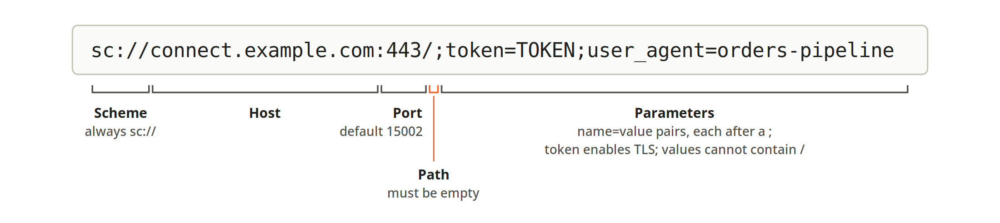

# Spark Connect in Apache Spark 4.2: How It Works and How to Adopt It

Spark Connect separates a Spark application from the Spark driver. The application builds a
DataFrame plan and sends it to a server, which runs it and streams the results back as Arrow. This
post covers why Spark adopted that design, how it works, how to adopt it (including how to migrate
an existing PySpark pipeline) and what it takes to build and use a Connect client. It is written for
engineers who already run Spark and want to understand the architecture before they change it.
Every claim is cited.

> Verified against Apache Spark **4.2.0** (released 2026-07-14) on 2026-09-09: an official
> `apache/spark:4.2.0-scala2.13-java21-python3-ubuntu` Connect server driven by
> `pyspark-client==4.2.0`.

Claims in this post carry one of three levels of provenance:

- **Unmarked**: reproduced against a live 4.2.0 server, or read from the shipped
  `pyspark-client==4.2.0` source. Package sizes, error classes, configuration defaults and API
  behaviors are in this category.
- **Per the documentation**: taken from the Spark documentation or a JIRA issue and cited, but not
  exercised here.
- **Untested here**: an environment that was not available for testing (Kubernetes, YARN), or a
  third-party claim.

---

## Table of Contents

1. [Why Spark Connect Exists](#1-why-spark-connect-exists)
2. [How Spark Connect Works](#2-how-spark-connect-works)
3. [Installing the Client](#3-installing-the-client)
4. [Running a Server](#4-running-a-server)
5. [Connection Strings](#5-connection-strings)
6. [Choosing Classic or Connect: `spark.api.mode`](#6-choosing-classic-or-connect-sparkapimode)
7. [API Differences](#7-api-differences)
8. [Eager and Lazy Analysis](#8-eager-and-lazy-analysis)
9. [Migrating an Existing Pipeline](#9-migrating-an-existing-pipeline)
10. [Upgrading from PySpark 4.1 to 4.2](#10-upgrading-from-pyspark-41-to-42)
11. [Operating Spark Connect](#11-operating-spark-connect)
12. [Auditing and Verifying a Migration](#12-auditing-and-verifying-a-migration)
13. [Building and Using a Spark Connect Client](#13-building-and-using-a-spark-connect-client)
14. [Scope of This Post](#14-scope-of-this-post)
15. [References](#15-references)

---

## 1. Why Spark Connect Exists

This section describes the architecture Spark Connect was designed to replace, the limitations that
motivated it, the design decision at its center, and how it has developed from Spark 3.4 to 4.2.
Readers who are familiar with the history can skip to §2.

### The Driver-Coupled Architecture

In a conventional Spark application, the application and the Spark driver are bound together. The
driver is the JVM process that holds the `SparkContext`, plans queries, schedules tasks on
executors, and loads every catalog plugin and JAR the application needs. In client deploy mode, the
application code runs alongside it on the same host and shares its lifetime.

PySpark makes the coupling concrete. A PySpark application is two processes on one machine: the
Python interpreter running the application, and a driver JVM that the Python process starts and
controls. Per the PySpark documentation, "on the driver side, PySpark communicates with the driver
on JVM by using Py4J": a bridge that lets Python call methods on JVM objects directly over a local
socket.


*Figure 1-1. The application and the driver in Spark Classic and Spark Connect*

This design has served Spark well, and it remains the default. Its consequences are that the client
must be close to the cluster, must carry a full Spark runtime and a JDK, and must share a process
lifetime with the driver and, on a shared cluster, a failure domain.

### The Limitations That Motivated Connect

In June 2022, Martin Grund filed the Spark Improvement Proposal (SPIP) for Spark Connect as
[SPARK-39375](https://issues.apache.org/jira/browse/SPARK-39375). It observes that Spark "was
designed nearly a decade ago, which, in the age of serverless computing and ubiquitous programming
language use, poses a number of limitations," and that "most of the limitations stem from the
tightly coupled Spark driver architecture and fact that clusters are typically shared across users."
The SPIP names four, summarized in Table 1-1.

*Table 1-1. Limitations of the driver-coupled architecture, as described in SPARK-39375*

| Limitation | As stated in the SPIP |
|---|---|
| Remote connectivity | The driver runs both the client application and the scheduler, so the application must be close to the cluster. Apart from SQL, there was no built-in way to connect to a cluster remotely, and users relied on external projects such as Apache Livy. |
| Developer experience | The architecture and APIs did not cater for interactive exploration in notebooks or for the tooling common in modern code editors. |
| Stability | With a shared driver, one user causing a critical exception such as an out-of-memory error brings the cluster down for all users. |
| Upgradability | Platform and client dependencies share one classpath, which prevents upgrading Spark independently of the applications that use it. |

The SQL exception in the first row is the Thrift JDBC/ODBC server, which Spark has long provided for
remote SQL access. It does not extend to the DataFrame API or to languages other than SQL.

### The Design Decision

The SPIP's answer was to separate the client from the driver along a line that already existed in
Spark: the DataFrame API and the logical plans it produces.

> We propose to overcome these challenges by building on the DataFrame API and the underlying
> unresolved logical plans. (SPARK-39375)

A DataFrame program does not compute anything as it is written; it builds a description of a
computation. Spark Connect serializes that description (an *unresolved* logical plan, in which
table and column names have not yet been checked against a catalog) and sends it to a server.
The server resolves it, optimizes it with Catalyst, and executes it exactly as it would a plan built
locally. The Spark documentation compares this to "parsing a SQL query, where attributes and
relations are parsed and an initial parse plan is built."

Using the plan as the protocol has three consequences that recur throughout this post:

- **The client needs no JVM.** Building a plan is pure data manipulation, so a client can be written
  in any language that can produce the protocol messages.
- **The server keeps all of Spark's optimizations.** Once a plan arrives it enters the standard
  execution path, so Connect does not fork the engine.
- **Anything that is not a plan cannot be expressed.** RDDs, direct access to the driver JVM, and
  mutation of cluster-wide state have no representation in the protocol. These are the APIs Connect
  does not support (§7).

The Spark Connect overview documents the operational benefits the design was intended to deliver:
**stability**, because an application that uses too much memory "will now only impact [its] own
environment"; **upgradability**, because "the Spark driver can now seamlessly be upgraded
independently of applications"; and **debuggability and observability**, because applications can
be developed from an IDE and monitored with their own framework's metrics and logging.

### A Short History

Table 1-2 lists the milestones. Each release row is taken from the Apache Spark release notes.

*Table 1-2. Spark Connect milestones*

| Date | Milestone | Reference |
|---|---|---|
| June 2022 | SPIP filed | [SPARK-39375](https://issues.apache.org/jira/browse/SPARK-39375) |
| July 2022 | Announced by Databricks (Leone, Grund, van Hövell, Xin) | *Introducing Spark Connect* |
| April 2023 | **Spark 3.4.0**: Python client for Spark Connect | Release notes |
| September 2023 | **Spark 3.5.0**: Scala and Go clients; Structured Streaming in Python and Scala; pandas API support; PyTorch-based distributed ML | [SPARK-43351](https://issues.apache.org/jira/browse/SPARK-43351), [SPARK-42938](https://issues.apache.org/jira/browse/SPARK-42938), [SPARK-42497](https://issues.apache.org/jira/browse/SPARK-42497), [SPARK-42471](https://issues.apache.org/jira/browse/SPARK-42471) |
| May 2025 | **Spark 4.0.0**: the `pyspark-client` pure-Python package; `spark.api.mode`; a release tarball with Connect enabled by default; ML on Spark Connect; a Swift client | [SPARK-47540](https://issues.apache.org/jira/browse/SPARK-47540), [SPARK-51212](https://issues.apache.org/jira/browse/SPARK-51212) |
| December 2025 | **Spark 4.1.0**: JDBC driver for Spark Connect | [SPARK-53484](https://issues.apache.org/jira/browse/SPARK-53484) |
| July 2026 | **Spark 4.2.0**: RDD-style APIs for the DataFrame client; execution status; YARN cluster mode; documentation of Connect's lazy analysis | [SPARK-55227](https://issues.apache.org/jira/browse/SPARK-55227), [SPARK-55606](https://issues.apache.org/jira/browse/SPARK-55606), [SPARK-55239](https://issues.apache.org/jira/browse/SPARK-55239), [SPARK-53882](https://issues.apache.org/jira/browse/SPARK-53882) |

Two points of status are easy to misread. The SPIP ticket itself has no fix version and remains in
the Reopened state, although the feature shipped in 3.4.0. And Spark Connect is **not** the default
in Spark 4.x: [SPARK-50411](https://issues.apache.org/jira/browse/SPARK-50411), "Spark Connect as the
default API in Spark 4," is open. An application uses Spark Classic unless it is configured otherwise
(§6).

**Citations:** [SPARK-39375](https://issues.apache.org/jira/browse/SPARK-39375), [Spark Connect Overview](https://spark.apache.org/docs/latest/spark-connect-overview.html), [PySpark Debugging Guide](https://spark.apache.org/docs/latest/api/python/development/debugging.html), [Distributed SQL Engine](https://spark.apache.org/docs/latest/sql-distributed-sql-engine.html), [Introducing Spark Connect, Databricks (2022)](https://www.databricks.com/blog/2022/07/07/introducing-spark-connect-the-power-of-apache-spark-everywhere.html), [Spark Release 3.4.0](https://spark.apache.org/releases/spark-release-3-4-0.html), [Spark Release 3.5.0](https://spark.apache.org/releases/spark-release-3-5-0.html), [Spark Release 4.0.0](https://spark.apache.org/releases/spark-release-4-0-0.html), [SPARK-50411](https://issues.apache.org/jira/browse/SPARK-50411)

---

## 2. How Spark Connect Works

This section describes where a Connect session lives, what travels between client and server, and
the RPCs that make up the protocol.

### The Session Lives on the Server

The most useful fact for reasoning about Spark Connect is that **the Spark session lives on the
server, and the client holds a reference to it.** Most practical questions follow from it: catalogs
are configured on the server because that is where the session resolves names; the client learns
what tables exist by asking the server; and a client can change only those settings that the server
reads at run time (§9, Layer 3).

A single Connect server hosts many sessions, one per client, isolated from one another. Five
analysts in five notebooks connected to one server have five independent sessions, each with its own
temporary views, session configuration and current catalog. What they share is the server's JVM, its
memory and its executors. Isolation stronger than that (hard resource limits, separate failure
domains, or a different Spark version on the server) requires separate servers rather than separate
sessions: every session on a server runs on that server's Spark build. The client library connecting
to it is a separate matter, described in "Client and Server Versions" below.


*Figure 2-1. One Connect server, with one isolated session for each client*

### Client and Server Versions

Separating the client from the driver makes their versions separable. The Spark Connect overview
describes the intent: "the Spark driver can now seamlessly be upgraded independently of
applications," and "applications can be forward-compatible, as long as the server-side RPC
definitions are designed to be backwards compatible." The application development guide describes
upgrading to a new server version as "seamless, as the Spark Connect API abstracts any
changes/improvements on the server side."

Three limits apply in practice:

- **No compatibility matrix is published.** The documentation states the design goal but does not
  list which client versions are supported against which server versions.
- **The supported direction is a newer server with an existing client.** That is what the documented
  forward compatibility describes. A client newer than its server can fail where the server lacks an
  RPC or reports a setting in an older format; Table 2-1 shows one of each.
- **Python versions remain coupled.** Independently of the Spark version, Python UDFs require the
  client and executors to use the same Python minor version (§7).

The rest of this post uses 4.2.0 on both sides. To show what a version difference looks like in
practice, `make matrix` runs fourteen operations in each direction between Spark 4.1.2 and 4.2.0.
Table 2-1 summarizes the two mixed pairings. It is a sample, not a compatibility matrix: an operation
that works here can still fail on a feature or setting the sample does not exercise.
`make matrix` reruns it, and `extras/version_matrix/results/` holds each run's output, including the
first line of every error.

*Table 2-1. A sample of operations across Spark 4.1.2 and 4.2.0*

| Operation | 4.2.0 client, 4.1.2 server | 4.1.2 client, 4.2.0 server |
|---|---|---|
| Connect, `spark.sql()`, `groupBy()`, `toPandas()`, `observe()` | works | works |
| Python UDF, with its dependency shipped by `addArtifact()` | works | works |
| Error class and SQL state for an unresolved column | same as matched versions | same as matched versions |
| `interruptAll()` | works | works |
| `createDataFrame()` from local Python data | **fails** with `ValueError` | works |
| `zipWithIndex()`, `emptyDataFrame(schema)` | works | not in the 4.1.2 client |
| `read.json()` given a DataFrame | works | **fails** with `AssertionError`, as it does against a 4.1.2 server |
| `GetStatus` RPC, through a private client method | **fails** with `UNIMPLEMENTED` | not in the 4.1.2 client |

The older client on the newer server behaved as it does on its own server: every result in that
column matches the 4.1.2 client against a 4.1.2 server, including the `read.json()` failure, which
is a limit of the 4.1.2 client rather than of the pairing.

The newer client on the older server failed in two places. `GetStatus` is an RPC added in 4.2, and a
4.1.2 server answers it with `UNIMPLEMENTED`, the expected result when a client is newer than its
server. The `createDataFrame()` failure is less obvious. Spark 4.2 added a client-side check on the
size of local data ([SPARK-55047](https://issues.apache.org/jira/browse/SPARK-55047)): before it
sends local data of any size, the 4.2.0 client reads the server setting
`spark.sql.session.localRelationSizeLimit` and converts it to an integer. A 4.2.0 server returns
`3221225472`; a 4.1.2 server returns `3221225472b`, and the conversion fails on the suffix. A 4.2.0
client therefore cannot build a DataFrame from a three-row Python list on a 4.1.2 server, while
DataFrames built with `spark.sql()` or `spark.range()` work.

### Plan In, Arrow Out

Figure 2-2 follows a single query from client to server and back.


*Figure 2-2. The path of a query through Spark Connect*

Because the plan is unresolved, the client does not know whether `iceberg.silver.orders` exists,
what columns it has, or which catalog serves it. It sends the name, and the server resolves it. This
is why a client with no catalog plugins can query an Iceberg table, provided the server is configured
for one.

The protocol represents DataFrame operations as Protocol Buffers messages. An abbreviated form of the
`Relation` message shows the correspondence with the DataFrame API:

```protobuf
message Relation {
  oneof rel_type {
    Read read = 1;            // spark.read / spark.table
    Project project = 2;      // .select()
    Filter filter = 3;        // .filter() / .where()
    Join join = 4;            // .join()
    Aggregate aggregate = 5;  // .groupBy().agg()
    Sort sort = 6;            // .orderBy()
    Limit limit = 7;          // .limit()
    // ... many more
  }
}
```

### The RPC Surface

The gRPC service defines twelve RPCs, listed in Table 2-2 from the generated service stub shipped in
`pyspark-client==4.2.0` (`pyspark/sql/connect/proto/base_pb2_grpc.py`).

*Table 2-2. Spark Connect RPCs in Spark 4.2*

| RPC | Purpose |
|-----|---------|
| `ExecutePlan` | Execute a plan; results stream back as Arrow |
| `AnalyzePlan` | Analyze a plan without executing it: schema, explain output |
| `Config` | Get and set session configuration |
| `AddArtifacts` | Upload Python files, JARs and archives to the session |
| `ArtifactStatus` | Check whether an artifact is already present, to avoid a second upload |
| `Interrupt` | Cancel a running operation |
| `ReattachExecute` | Reconnect to a running execution after a dropped connection |
| `ReleaseExecute` | Notify the server that the client has consumed an execution's results |
| `ReleaseSession` | Release the server-side session |
| `CloneSession` | Copy a session's state into a new session |
| `GetStatus` | Query execution status (new in 4.2) |
| `FetchErrorDetails` | Retrieve the full server-side error, including the JVM stack trace |

Two of these explain behavior that is otherwise surprising. `ReleaseExecute` is how the server knows
it can discard buffered results. `FetchErrorDetails` is why a traceback on a client with no JVM can
contain a JVM stack trace.

### Reliability Features

Two properties of the protocol matter when the network between client and server is not a loopback
interface.

**Reattachment.** `ReattachExecute` lets a client reattach, by operation ID, to an execution that is
still running on the server after the connection drops, rather than losing the query. Spark 4.2 fixed
race conditions in the client's reattach iterator
([SPARK-55406](https://issues.apache.org/jira/browse/SPARK-55406)).

**Plan compression.** Large plans can be compressed before they are sent. In the 4.2 client
(`pyspark/sql/connect/client/core.py`), the compression threshold and algorithm are fetched from the
server rather than fixed by the client; zstandard is used only if it is installed; and compression
is disabled for the remainder of the session if the server cannot interpret a compressed plan.
Compression is therefore a negotiated, size-triggered optimization with a fallback, rather than a
fixed property of the protocol.

### Observing the Division of Labor

The split between client and server can be observed directly. Calling `df.explain()` from a client
with no JVM prints the server's physical plan, because the client has no optimizer of its own:

```
== Physical Plan ==
AdaptiveSparkPlan isFinalPlan=false
+- Sort [avg_ticket#1075 DESC NULLS LAST], true, 0
   +- Exchange rangepartitioning(avg_ticket#1075 DESC NULLS LAST, 200), ENSURE_REQUIREMENTS
      +- HashAggregate(keys=[region#1071], functions=[count(1), avg(total#1073)])
```

### What Changes for an Application

For an application, adopting Connect changes where code runs rather than what the code says. The
DataFrame and SQL code of a pipeline is unaffected; §9 demonstrates this on a 357-line production
pipeline in which no transformation logic changes.

The application gains a client process with no JVM and no JDK, no Spark JARs on client machines, a
client whose failure does not take the driver down, the ability to upgrade the server without
redeploying applications (within the limits described in "Client and Server Versions"), and
credentials that are held by the server rather than by every client. It gives up
`SparkContext`, RDDs, and direct access to the driver JVM. Spark 4.2 reduced that surface; §7 lists
what remains.

**Citations:** [SPARK-39375](https://issues.apache.org/jira/browse/SPARK-39375), [Spark Connect Overview](https://spark.apache.org/docs/latest/spark-connect-overview.html), [Application Development with Spark Connect](https://spark.apache.org/docs/latest/app-dev-spark-connect.html), [SPARK-55406](https://issues.apache.org/jira/browse/SPARK-55406)

---

## 3. Installing the Client

PyPI carries four distributions that provide the `pyspark` namespace. Only one of them is a client
without a JVM, and the names are close enough to be confused. This section compares them and shows
how to tell which one is installed.

### The Four Distributions

Table 3-1 shows each distribution as measured against 4.2.0. Installed sizes are `du` measurements
on CPython 3.10.20, installed with uv with bytecode compiled.

*Table 3-1. PySpark distributions on PyPI, version 4.2.0*

| Package | PyPI artifact | `pyspark/` installed | JARs | Py4J | `spark.remote` | Local server |
|---------|---------------|----------------------|------|------|----------------|--------------|
| `pyspark` | 429.28 MB sdist | 481 MB | 456 MB, 276 JAR files | yes | no | no |
| `pyspark[connect]` | 429 MB plus extras | 481 MB | 456 MB | yes | yes | yes |
| `pyspark-connect` | 0.01 MB | installs `pyspark` | 456 MB | yes | yes | yes |
| `pyspark-client` | 1.60 MB | 19 MB | none | no | yes | no |

`pyspark-client` is the client without a JVM. `pyspark-connect` is not: it is a metapackage whose
dependencies are `pyspark==4.2.0` and the Connect client's own dependencies (pandas, PyArrow, gRPC,
zstandard and others), so installing it installs the full distribution. The Spark 4.2 Connect overview documents `pip install pyspark-client==4.2.0` for
standalone client applications.

`pyspark-client` was introduced in Spark 4.0.0 as the outcome of the pure-Python package SPIP
([SPARK-47540](https://issues.apache.org/jira/browse/SPARK-47540),
[SPARK-51212](https://issues.apache.org/jira/browse/SPARK-51212)). The installation instruction on
the Connect overview page changed later: the 4.0.0 page shows `pip install pyspark[connect]==4.0.0`,
and the 4.1 and 4.2 pages show `pyspark-client`. Instructions written against 4.0 are therefore out
of date rather than incorrect.

### What the Client Without a JVM Saves

Table 3-2 compares a full installation with `pyspark-client`.

*Table 3-2. Full distribution compared with `pyspark-client`*

| Comparison | Full | `pyspark-client` | Reduction |
|---|---|---|---|
| Spark's own Python payload (`pyspark/`) | 481 MB | 19 MB | 96% |
| Spark JARs on the client | 456 MB, 276 JAR files | 0 | 100% |
| JDK required on the client | yes | no | n/a |
| Virtual environment with the Connect dependencies | 820 MB (`pyspark[connect]`) | 359 MB | 56% |

The reduction in the last row is smaller because `pyarrow` (154 MB), `pandas` (65 MB) and `numpy`
(41 MB) are required dependencies of the Connect client, and together they are much larger than the
client's own `pyspark/` directory. The accurate description of `pyspark-client` is that it requires
no JVM, no JDK and no Spark JARs; it does not produce a small environment.

![Stacked bars. The pyspark[connect] environment is 820 MB: 25 MB of pyspark/ without JARs, 456 MB of Spark JARs and 339 MB of required dependencies. The pyspark-client environment is 359 MB: 19 MB of pyspark/ and 340 MB of required dependencies.](graphics/blog/fig3-1_environment_size.png)

*Figure 3-1. The two environments by component. The dependencies are the same size in both; the difference is the Spark JARs*

Two notes apply when reproducing these figures. The environment sizes include runtime dependencies
only. This project's environments also contain development tools (pytest and ruff): `.venv` measures
396 MB and `.venv-full` 857 MB. Second, plain `pyspark` installs neither pandas nor PyArrow (483 MB),
so it is not a like-for-like comparison for a DataFrame application that converts to pandas.

### Identifying the Installed Distribution

The reliable test is structural rather than numeric: `pyspark-client` has no `pyspark/jars`
directory and does not install Py4J.

```python
import importlib.metadata, importlib.util, pathlib, pyspark

print(importlib.metadata.version("pyspark-client"))        # raises if pyspark-client is absent
print(pathlib.Path(pyspark.__file__).parent / "jars")      # pyspark-client: does not exist
print(importlib.util.find_spec("py4j") is not None)        # pyspark-client: False
```

`examples/03_which_client.py` performs these checks and prints the size of `pyspark/` as a sum of
file sizes: 17 MB for `pyspark-client` and 500 MB for the full distribution. A sum of file sizes is
smaller than the disk usage that `du` reports.

**Citations:** [PySpark Installation](https://spark.apache.org/docs/latest/api/python/getting_started/install.html), [Spark Connect Overview](https://spark.apache.org/docs/latest/spark-connect-overview.html), [SPARK-47540](https://issues.apache.org/jira/browse/SPARK-47540), [SPARK-51212](https://issues.apache.org/jira/browse/SPARK-51212), [Spark Release 4.0.0](https://spark.apache.org/releases/spark-release-4-0-0.html), [pyspark on PyPI](https://pypi.org/project/pyspark/), [pyspark-client on PyPI](https://pypi.org/project/pyspark-client/), [pyspark-connect on PyPI](https://pypi.org/project/pyspark-connect/)

---

## 4. Running a Server

This section covers starting a Connect server, its principal configuration, where to run it, and how
a client locates it.

### Starting the Server

The Connect server ships with the Spark distribution:

```bash
tar -xvf spark-4.2.0-bin-hadoop3.tgz
cd spark-4.2.0-bin-hadoop3
./sbin/start-connect-server.sh
```

Instructions written for Spark 3.5 add `--packages org.apache.spark:spark-connect_2.12:3.5.x` to
this command. Since Spark 4.0 the server is included in the distribution and the documentation no
longer uses the flag; omit it.

In a container, pass `--wait`. It sets `SPARK_NO_DAEMONIZE=1`, which keeps the server in the
foreground; without it the script daemonizes and the container exits.

```yaml
command:
  - bash
  - -c
  - >-
    /opt/spark/sbin/start-connect-server.sh --wait
    --conf spark.connect.grpc.binding.host=0.0.0.0
    --conf spark.connect.grpc.binding.port=15002
```

### Server Configuration

*Table 4-1. Principal Spark Connect server configuration*

| Configuration | Default | Since |
|---|---|---|
| `spark.api.mode` | `classic` | 4.0.0 |
| `spark.connect.grpc.binding.host` | (none; all interfaces) | 4.0.0 |
| `spark.connect.grpc.binding.address` | (none) | 4.0.0 |
| `spark.connect.grpc.binding.port` | 15002 | 3.4.0 |
| `spark.connect.grpc.port.maxRetries` | 0 | 4.0.0 |
| `spark.connect.grpc.maxInboundMessageSize` | 134217728 | 3.4.0 |
| `spark.connect.grpc.arrow.maxBatchSize` | 4m | 3.4.0 |
| `spark.connect.grpc.interceptor.classes` | (none) | 3.4.0 |
| `spark.connect.extensions.{relation,expression,command}.classes` | (none) | 3.4.0 |
| `spark.connect.progress.reportInterval` | 2s | 4.0.0 |
| `spark.connect.jvmStacktrace.maxSize` | 1024 | 3.5.0 |
| `spark.sql.connect.enrichError.enabled` | true | 4.0.0 |

Both `binding.host` and `binding.address` are registered configurations; a live 4.2.0 server returns
a value for each. `binding.host` is the one used in the Spark documentation and in this post. With
neither setting, a 4.2.0 server listens on all interfaces: started from the official image with no
binding configuration, it listened on `[::]:15002`. Set `binding.host` to `127.0.0.1` to accept only
local connections, or to the address of a specific interface.

`port.maxRetries` defaults to 0. A port conflict is therefore a startup failure rather than a silent
move to the next port, which keeps clients and server in agreement about where the server listens.

### Choosing a Topology

The client code is identical in every deployment shape, so the choice of where the server runs is
an operational decision rather than an application change. Table 4-2 summarizes the options.

*Table 4-2. Spark Connect deployment topologies*

| Topology | Where the server runs | Suited to |
|---|---|---|
| In-process | Inside the Python process (`spark.remote=local[*]`) | Tests, CI, a workstation with no cluster |
| Same host, separate process | A local daemon | Development against a session that outlives the client |
| Remote standalone | One server in front of one cluster | A shared team cluster |
| Kubernetes | A Deployment behind a Service | Multi-tenant platforms; per-team endpoints |
| YARN cluster mode | Inside a YARN application master ([SPARK-55239](https://issues.apache.org/jira/browse/SPARK-55239), 4.2) | An existing Hadoop deployment |
| Multiple clusters | Several servers, selected by the client | Routing by workload size, cost or region; blue-green upgrades |

Two considerations apply across these topologies. The in-process form runs the Connect code path
(`spark.sparkContext` raises there as it does against a remote server), which makes it suitable for
Connect compatibility tests in CI. And because each Connect server holds its own session state, a
Kubernetes Service that load-balances across replicas can route a client to a pod that does not hold
its session. Use session affinity, or one Deployment per logical tenant. (**Untested here**; this
follows from session state being local to the server, as described in §2.)

Configurations for each topology (an annotated launch script, Kubernetes manifests with RBAC and
gRPC ingress, and runnable in-process and multi-cluster examples) are in
[`setup/TOPOLOGIES.md`](setup/TOPOLOGIES.md).

### Pointing a Client at the Server

A client can be directed to a server in three ways:

```bash
export SPARK_REMOTE="sc://localhost:15002"     # 1. environment variable
./bin/pyspark --remote "sc://localhost:15002"   # 2. command-line option
```

```python
spark = SparkSession.builder.remote("sc://localhost:15002").getOrCreate()  # 3. in code
```

With none of these set, a full PySpark installation starts a Spark Classic driver as before.

**Citations:** [Spark Connect Overview](https://spark.apache.org/docs/latest/spark-connect-overview.html), [Configuration: Spark Connect](https://spark.apache.org/docs/latest/configuration.html), [start-connect-server.sh @ v4.2.0](https://github.com/apache/spark/blob/v4.2.0/sbin/start-connect-server.sh), [SPARK-55239](https://issues.apache.org/jira/browse/SPARK-55239)

---

## 5. Connection Strings

A Spark Connect connection string has the following form:

```
sc://host:port/;param1=value1;param2=value2
```



*Figure 5-1. The parts of a connection string*

The scheme is fixed, the path component must be empty, and parameter names are case-sensitive.
Table 5-1 lists the parameters.

*Table 5-1. Connection string parameters*

| Parameter | Default | Description |
|---|---|---|
| `port` | `15002` | Server port |
| `token` | (none) | Bearer token; setting it enables TLS |
| `use_ssl` | `false` | Enable TLS |
| `user_id` | (none) | User identifier for session attribution |
| `user_agent` | `_SPARK_CONNECT_PYTHON` | Identifies the calling application in server logs |
| `session_id` | random UUID | Set explicitly to share one server-side session |
| `grpc_max_message_size` | `134217728` | Maximum gRPC message size (128 MiB) |

### Constraints

Three constraints are worth knowing before a connection string is built programmatically.

**The path must be empty.** `sc://host:443/myprefix/;token=…` is invalid, because gRPC uses the path
itself. A path prefix, if one is required, belongs on a proxy in front of the server.

**A token enables TLS.** Setting `token` turns on TLS, so a bearer token is never sent over an
unencrypted connection.

**Parameter values cannot contain `/`.** The specification does not state this, and the resulting
error names the path rather than the parameter. With `pyspark-client` 4.2.0:

```python
SparkSession.builder.remote("sc://localhost:15002/;user_agent=myapp/setup").create()
# PySparkValueError: [INVALID_CONNECT_URL] Invalid URL for Spark Connect:
#   The path component '/;user_agent=myapp/setup' must be empty.
```

The slash inside the value is parsed as the start of a path. `user_agent=myapp-setup` is accepted.
Validate parameter values before building the string. `examples/07_connection_strings.py` shows
both forms.

**Citations:** [client-connection-string.md @ v4.2.0](https://github.com/apache/spark/blob/v4.2.0/sql/connect/docs/client-connection-string.md), [Spark Connect Overview](https://spark.apache.org/docs/latest/spark-connect-overview.html)

---

## 6. Choosing Classic or Connect: `spark.api.mode`

`spark.api.mode`, introduced in Spark 4.0, selects between Spark Classic and Spark Connect for an
application. It makes adoption incremental: a single job can be moved to Connect, and back, without
a change to its code.

### Setting the Mode

The configuration accepts `classic` or `connect`:

```python
SparkSession.builder.config("spark.api.mode", "connect").master("spark://host:7077").getOrCreate()
```

```bash
spark-submit --master spark://host:7077 --conf spark.api.mode=connect job.py
```

`classic` is the behavior when the key is absent, not a stored value. On a server where the key was
never set, `spark.conf.get("spark.api.mode")` raises `SparkNoSuchElementException
[SQL_CONF_NOT_FOUND]` rather than returning `"classic"`, so code that inspects the mode should handle
that case. The `doctor` in this project reports it as `<unset>`.

### `spark.api.mode` and `spark.remote`

The documentation distinguishes the two settings as follows:

> "`spark.remote` and `--remote` are limited to `local*` values, while `--conf spark.api.mode=connect`
> with `--master ...` supports additional cluster URLs, such as `spark://`, for broader compatibility
> with Spark Classic."

The sentence concerns which component starts the server; `spark.remote` continues to accept `sc://`
URLs for a server that is already running. Table 6-1 sets out the cases.

*Table 6-1. Selecting a Connect server*

| Requirement | Configuration |
|---|---|
| Connect to a server that is already running | `spark.remote=sc://host:15002` |
| Have Spark start a local server | `spark.remote=local[*]` or `local-cluster[...]` |
| Run against an existing cluster master, with Spark starting the server | `spark.api.mode=connect` with `--master spark://host:7077` |

The third row is what makes `spark.api.mode` suited to migrating an existing `spark-submit` job: the
submit command keeps its `--master`, and one configuration value determines the execution path. This
supports two practices:

- **Reversible, per-job migration.** Move one job, observe it, and move it back if necessary, with no
  branch and no second copy of the code.
- **Comparison in CI.** Run the same job in both modes and compare the outputs. §12 describes how to
  make that comparison meaningful.


*Figure 6-1. One job, and one configuration value that selects its execution path*

**Citations:** [Application Development with Spark Connect](https://spark.apache.org/docs/latest/app-dev-spark-connect.html), [Configuration](https://spark.apache.org/docs/latest/configuration.html), [SPARK-50411](https://issues.apache.org/jira/browse/SPARK-50411)

---

## 7. API Differences

Because Spark Connect communicates in logical plans, APIs that operate outside a plan are not
available to a Connect client. This section lists them as they appear in the 4.2.0 client source,
describes the substitutes, and notes the gaps Spark 4.2 closed.

### Unsupported APIs

The documentation describes the unsupported surface in prose; the 4.2.0 client enumerates it.
`python/pyspark/sql/connect/session.py` raises `PySparkAttributeError` with the error class
`JVM_ATTRIBUTE_NOT_SUPPORTED` for these session attributes:

`_jsc`, `_jconf`, `_jvm`, `_jsparkSession`, `sparkContext`, `newSession`

`python/pyspark/sql/connect/dataframe.py` does the same for these DataFrame attributes:

`_jseq`, `_jdf`, `_jmap`, `_jcols`, `rdd`

All raise the same error class, including `rdd`. Everything reached through `SparkContext` is
unavailable with it: `setLogLevel`, `addFile`, `addPyFile`, broadcast variables created with
`SparkContext.broadcast()`, and accumulators.

Two entries warrant comment. `newSession()` is not prominent in the documentation; to obtain a second
session, create one with `builder.create()` (see "Session Reuse" later in this section). And RDDs are
a permanent difference rather than a pending one: the protocol has no representation for a closure
executed against RDD partitions.

### `enableHiveSupport()`

`SparkSession.Builder.enableHiveSupport()` behaves differently from the attributes above: it does not
raise. Against a 4.2.0 server the builder succeeds and returns a working session, and the only
indication is a `UserWarning`:

```
Failed to set spark.sql.catalogImplementation to Some(hive) due to [CANNOT_MODIFY_STATIC_CONFIG]
```

After the warning, `spark.sql.catalogImplementation` remains `in-memory`. A client that requests Hive
support therefore receives a session without it. The reason is the same one that governs all
static configuration under Connect (§9, Layer 3). Lists of Connect limitations often describe this
call as raising an error; in 4.2.0 it does not.

### Accumulators and Broadcast Variables

Accumulators are created with `SparkContext.accumulator()`, and broadcast variables with
`SparkContext.broadcast()`. Since `SparkContext` is unavailable, neither can be created under
Connect; calling either against a 4.2 session raises. The broadcast *join hint* is a different API
and is supported. Table 7-1 distinguishes them.

*Table 7-1. Accumulators, broadcast and their Connect equivalents*

| API | Under Connect |
|---|---|
| `pyspark.sql.functions.broadcast(df)` (join hint) | Supported |
| `SparkContext.broadcast(value)` (broadcast variable) | Unavailable |
| Accumulators | Unavailable |
| `DataFrame.observe()` with `Observation` | Supported; the replacement for accumulators |

`Observation` collects named metrics during an action:

```python
from pyspark.sql import Observation, functions as f

obs = Observation("rows")
df.observe(obs, f.count(f.lit(1)).alias("n")).write.saveAsTable("t")
print(obs.get["n"])
```

`Observation.get` is a property that returns a `dict` of the named metrics, so it is indexed rather
than called. Reading it blocks until the action that populates it has completed.

`foreach` and `foreachPartition` are also supported, and have been labeled "Supports Spark Connect"
in the API reference since 4.0.

### APIs Added in Spark 4.2

Spark 4.2 added several APIs whose absence previously required Spark Classic, under the umbrella
issue [SPARK-55227](https://issues.apache.org/jira/browse/SPARK-55227). Table 7-2 lists them with
related 4.2 changes.

*Table 7-2. Connect API additions and fixes in Spark 4.2*

| Change | JIRA |
|---|---|
| `DataFrame.zipWithIndex` (PySpark) | [SPARK-55229](https://issues.apache.org/jira/browse/SPARK-55229) |
| `Dataset.zipWithIndex` (Scala) | [SPARK-55228](https://issues.apache.org/jira/browse/SPARK-55228) |
| `DataFrame.toJSON` (Python client) | [SPARK-55090](https://issues.apache.org/jira/browse/SPARK-55090) |
| `spark.read.json` accepts a DataFrame | [SPARK-56253](https://issues.apache.org/jira/browse/SPARK-56253) |
| `spark.read.xml` accepts a DataFrame | [SPARK-56254](https://issues.apache.org/jira/browse/SPARK-56254) |
| `spark.read.csv` accepts a DataFrame | [SPARK-56255](https://issues.apache.org/jira/browse/SPARK-56255) |
| `SparkSession.emptyDataFrame` | [SPARK-56256](https://issues.apache.org/jira/browse/SPARK-56256) |
| `head()`, `take()` and `tail()` avoid full table scans | [SPARK-55887](https://issues.apache.org/jira/browse/SPARK-55887) |
| `ArrowDeserializer` binds by position (duplicate column names) | [SPARK-56007](https://issues.apache.org/jira/browse/SPARK-56007) |
| Connect server in YARN cluster mode | [SPARK-55239](https://issues.apache.org/jira/browse/SPARK-55239) |

The DataFrame-input readers cover JSON, XML and CSV only, not Parquet, ORC or text. `emptyDataFrame`
is a method that takes a schema (`spark.emptyDataFrame("a int")`) rather than a property.
SPARK-55239 is resolved with fix version 4.2.0 but is not itemized in the 4.2.0 release notes.

### Session Reuse with `getOrCreate()`

`getOrCreate()` returns the process's cached active session **even when the builder names a
different `remote` URL**, without an error or a warning:

```python
a = SparkSession.builder.remote("sc://good-server:15002").getOrCreate()
b = SparkSession.builder.remote("sc://127.0.0.1:1").getOrCreate()
assert b is a     # passes
```

Code intended to connect to a second server therefore connects to the first. The same sharing
applies to shutdown: calling `stop()` on the shared object ends the session for all code in the
process that holds it.

`builder.create()` always creates a new server-side session. Sessions created this way are isolated:
two of them can register the same temporary view name with different contents, and stopping one
leaves the other running. `examples/05_sessions.py` demonstrates reuse, isolation and the rejection
shown next.

`create()` does not accept a `local*` remote:

```python
SparkSession.builder.remote("local[2]").create()
# PySparkRuntimeError: [UNSUPPORTED_LOCAL_CONNECTION_STRING]
```

`getOrCreate()` is therefore required for the in-process topology, and `create()` is preferable for
every `sc://` endpoint. To choose between them, catch `UNSUPPORTED_LOCAL_CONNECTION_STRING` rather
than testing the URL: a test such as `url.startswith("local")` also matches `localhost`.

### Python Version Coupling

A client without a JVM is still coupled to the server's Python version. A Python UDF is serialized
on the client and deserialized on an executor, and PySpark refuses to run across minor versions:

```
[PYTHON_VERSION_MISMATCH] Python in worker has different version: 3.10
than that in driver: 3.12, PySpark cannot run with different minor versions.
```

The official `apache/spark:4.2.0-*-python3-ubuntu` images ship Python 3.10.12, so a Python 3.12
client cannot run a Python UDF against them without modification. Match the client's Python minor
version to the server's, or install the client's version on the server. This project pins its
client to Python 3.10 (`.python-version`, and `requires-python` in `pyproject.toml`).

The official 4.2.0 image has a second limitation for Python UDFs: it does not include PyArrow, and
Spark 4.2 enables Arrow-optimized Python UDFs by default
([SPARK-54555](https://issues.apache.org/jira/browse/SPARK-54555)). Against the unmodified image,
every Python UDF fails on the executor with `ModuleNotFoundError: No module named 'pyarrow'`, while
`toPandas()` still works. The client reads `spark.sql.execution.pythonUDF.arrow.enabled` when a UDF
is created (`pyspark/sql/connect/udf.py`), so setting it to `false` in the session avoids the failure
only for UDFs defined afterward; `udf(..., useArrow=False)` avoids it for a single UDF. Adding PyArrow
to the image avoids it for every UDF, and this project's `Dockerfile` does that (`pyarrow` 25.0.1
and `pandas` 2.3.3). The official 4.1.2 image runs Python UDFs unmodified,
because Spark 4.1 does not enable that setting by default.

### Checking Compatibility

Apache Spark does not ship a Connect compatibility checker. The official mechanism is the "Supports
Spark Connect" label in the API reference. §12 describes a static audit included with this project.

**Citations:** [Spark Connect Overview](https://spark.apache.org/docs/latest/spark-connect-overview.html), [session.py @ v4.2.0](https://github.com/apache/spark/blob/v4.2.0/python/pyspark/sql/connect/session.py), [dataframe.py @ v4.2.0](https://github.com/apache/spark/blob/v4.2.0/python/pyspark/sql/connect/dataframe.py), [SPARK-55227](https://issues.apache.org/jira/browse/SPARK-55227), [SPARK-55239](https://issues.apache.org/jira/browse/SPARK-55239), [DataFrame.observe](https://spark.apache.org/docs/latest/api/python/reference/pyspark.sql/api/pyspark.sql.DataFrame.observe.html)

---

## 8. Eager and Lazy Analysis

In Spark Classic, a DataFrame is analyzed as soon as it is defined: column names are resolved
against the catalog, types are checked, and a malformed reference raises an `AnalysisException` on
the line that introduced it. Spark Connect defers this work. The client builds an unresolved plan
(see §2) and sends it to the server only when it needs an answer: when an action runs, or when the
client requests the schema. This section describes the four behavior differences that follow from
that design, and how to write code that behaves the same way in both modes.

The Spark 4.2 documentation covers the same material in *Eager vs Lazy: Spark Connect vs Spark
Classic* ([SPARK-53882](https://issues.apache.org/jira/browse/SPARK-53882)). The page is not linked
from the main documentation navigation, and it is recommended reading before migrating an existing
code base.

Table 8-1 summarizes the differences.

*Table 8-1. Evaluation behavior in Spark Classic and Spark Connect*

| Aspect | Spark Classic | Spark Connect |
|---|---|---|
| Query execution | Lazy | Lazy |
| Command execution | Eager | Eager |
| Schema analysis | Eager | Lazy |
| Schema access | Local | Remote `AnalyzePlan` call, then cached |
| Temporary views | Plan captured at registration | Name resolved at execution |
| UDF serialization | At definition | At execution |

Query execution itself is unchanged: in both modes, transformations are recorded and nothing runs
until an action is invoked. The last four rows are where code written for Classic can produce
different results under Connect. In each case the difference is silent: no error is raised at the
point where the behavior diverges.

### Temporary View Names

When a temporary view is registered in Spark Classic, the view captures the plan of the DataFrame it
was created from. Spark Connect records only the view's name, and resolves that name each time a
plan that references it is executed. Replacing a view therefore changes the result of every
DataFrame that was built on the earlier definition:

```python
a.createOrReplaceTempView("brands")
first = spark.table("brands")
b.createOrReplaceTempView("brands")
first.count()     # Classic: rows of a    Connect: rows of b
```


*Figure 8-1. What a DataFrame built on a temporary view holds in each mode*

To avoid this, give each temporary view a unique name (appending a UUID is sufficient), or
materialize the DataFrame before the view is replaced.

### UDFs That Capture Variables

Spark Connect serializes a Python UDF when the plan that uses it is executed, not when the UDF is
defined. A UDF that refers to a variable from its enclosing scope therefore sees that variable's
value at execution time:

```python
x = 123

@udf("int")
def f():
    return x

df = spark.range(1).select(f())
x = 456
df.show()         # Classic: 123    Connect: 456
```

The same applies to UDFs defined inside a loop: each of them observes the final value of the loop
variable. To bind a value when the UDF is defined, create the UDF from a factory function that takes
the value as an argument, or pass the value to the UDF as a literal column.

### Deferred Analysis Errors

Because Connect does not analyze a plan until it is needed, an invalid column reference raises
nothing while the plan is being built:

```python
try:
    df2 = df.filter(col("typo") > 6)    # Connect: no exception here
except AnalysisException:
    handle()                             # not reached under Connect
```

Under Connect, the error is raised later, at the first action or schema access on `df2`, and code
that expects to catch it around the transformation does not. To keep the check where it is, force
analysis inside the `try` block by accessing `df2.schema` or `df2.columns`. Alternatively, move the
exception handler so that it surrounds the action.

### Repeated Schema Access

In Spark Classic, `df.columns` reads a schema the driver already holds. In Spark Connect, the first
schema access on a DataFrame is a remote `AnalyzePlan` call. The result is cached for that
DataFrame, but `withColumn` returns a new DataFrame whose schema has not yet been fetched. A common
Classic pattern therefore makes a round trip each time the loop replaces `df`:

```python
for name in wanted:
    if name not in df.columns:          # AnalyzePlan call whenever df is new
        df = df.withColumn(name, lit(None))
```

Read the schema once, and add the missing columns in a single projection:

```python
existing = set(df.columns)              # one AnalyzePlan call
missing = [lit(None).alias(n) for n in wanted if n not in existing]
df = df.select("*", *missing)
```

The second form also benefits Spark Classic: the `withColumn` API documentation recommends a single
`select` over repeated `withColumn` calls, because each call adds a projection to the plan.

**Citations:** [Eager vs Lazy: Spark Connect vs Spark Classic](https://spark.apache.org/docs/latest/spark-connect-gotchas.html), [SPARK-53882](https://issues.apache.org/jira/browse/SPARK-53882), [`DataFrame.withColumn`](https://spark.apache.org/docs/latest/api/python/reference/pyspark.sql/api/pyspark.sql.DataFrame.withColumn.html), [Compare Spark Connect to Spark Classic, Databricks](https://docs.databricks.com/aws/en/spark/connect-vs-classic)

---

## 9. Migrating an Existing Pipeline

A migration to Spark Connect is not a single change. It consists of seven independent layers, of
which only the first is mandatory. This section describes each layer, what changes in it and what
does not, and how to confirm it is complete. It ends with the order in which to carry the layers out.

The worked example is `~/lakehouse-stack/scripts/pipelines/pipeline_spark41.py`: a 357-line pipeline
that materializes 10 Iceberg tables (5 bronze, 2 silver, 3 gold) through a decorator framework
modeled on Spark Declarative Pipelines. The before and after files and an annotated diff are in the
written case study, [`case_study/lakehouse_stack/`](case_study/lakehouse_stack/README.md). Across the
migration, no line of transformation logic changes: Connect moves where the code executes, not the
code itself. A smaller pipeline that runs without the lakehouse stack, with one change in each
layer, is in [`pipeline/`](pipeline/MIGRATION.md).

*Table 9-1. The seven layers of a Spark Connect migration*

| Layer | Area | Scope of change |
|---|---|---|
| 0 | Session creation | One call |
| 1 | Pipeline logic | Audit; few changes |
| 2 | Data sources and catalogs | Configuration relocates to the server |
| 3 | Configuration | Divides between client and server |
| 4 | Dependencies | Replaced by `addArtifact` |
| 5 | Execution and operations | Submission, logging and lifecycle change |
| 6 | Security and identity | Credentials leave the client |

### Layer 0: Session Creation

Only the code that obtains a `SparkSession` changes. A builder that honors both mechanisms from §6
lets the same file run in either mode:

```python
def build_session(name: str) -> SparkSession:
    remote = os.getenv("SPARK_REMOTE")
    builder = SparkSession.builder.appName(f"Pipeline_{name}")
    if remote:
        return builder.remote(remote).getOrCreate()
    if os.getenv("SPARK_API_MODE") == "connect":
        return builder.config("spark.api.mode", "connect").getOrCreate()
    return builder.getOrCreate()
```

Everything downstream of the session object is unaffected. If a process holds more than one session,
use `builder.create()`, for the reason given in §7.

To verify this layer, run the job with `SPARK_REMOTE` set and unset; it should complete in both cases.

### Layer 1: Pipeline Logic

DataFrame and SQL code does not change, and the APIs that do break are enumerable (§7). In the worked
example, one line of 357 fails under Connect:

```python
self._spark.sparkContext.setLogLevel("WARN")   # raises under Connect
```

Across the 51 Python files of the `lakehouse-stack/scripts/` tree, the audit described in §12 finds
21 blocking findings, all of them this same call, and no RDD operations, Py4J access or accumulators.

Code that inspects itself is also unaffected. The framework in the worked example infers table
dependencies by reading its own source:

```python
source = inspect.getsource(func)
deps = set(re.findall(r'spark\.table\(["\']([^"\']+)["\']\)', source))
```

This runs unchanged, because it is client-side Python that never calls Spark; the topological sort
built on it is likewise unchanged.

The changes in this layer that do not raise are the behavior differences in §8. To find the blocking
calls, a text search is a starting point:

```bash
grep -rn "sparkContext\|\.rdd\|_jvm\|_jsc\|_jdf\|enableHiveSupport" .
```

A text search cannot detect a temporary view registered twice or schema access inside a loop; §12
describes a static audit that can.

### Layer 2: Data Sources and Catalogs

The catalog is configured where the session lives. Under `spark-submit`, that was a driver started
for each job; under Connect, it is the long-lived Connect server. The configuration itself is the
same, and so is the code that uses it: `spark.table("iceberg.silver.orders_enriched")` does not
change.

The client learns what exists by asking the server. A table name is sent as an unresolved string;
the server resolves it against its own catalog manager, retrieves metadata from the catalog backend,
and reads the data. `spark.catalog.listTables()` and `df.schema` are remote calls. Nothing is
preloaded or cached on the client, and the client never accesses Iceberg metadata, Parquet files,
Postgres or object storage directly. Only result rows travel to the client, as Arrow.

For a catalog configured as follows, every line remains as it is, on the server:

```
spark.sql.extensions                org.apache.iceberg.spark.extensions.IcebergSparkSessionExtensions
spark.sql.catalog.iceberg           org.apache.iceberg.spark.SparkCatalog
spark.sql.catalog.iceberg.type      jdbc
spark.sql.catalog.iceberg.uri       jdbc:postgresql://localhost:5432/iceberg_catalog
spark.sql.catalog.iceberg.warehouse s3a://lakehouse/warehouse
```

File paths, however, now resolve on the server. The worked example's bronze tables read:

```python
spark.read.parquet("/data/dimensions/categories.parquet")
```

This path works because the Connect server has `/data` mounted. If the server runs on a host without
that mount, all five bronze tables fail with a path-not-found error that does not indicate its cause.
Audit local paths as part of this layer.

To verify this layer, call `spark.catalog.listTables("iceberg.silver")` from the client and confirm
that it returns the expected tables.

### Layer 3: Configuration

Configuration divides between client and server according to a single rule: a client can set values
that the server reads at run time, but not configuration that loads classes. The client has no JVM
and therefore no class loader, so a class name set from the client has nothing to load it. Table 9-2
applies the rule.

*Table 9-2. Configuration a Connect client can and cannot set*

| Configuration | Settable from the client | Reason |
|---|---|---|
| `spark.sql.shuffle.partitions` | Yes | A value the server reads at run time |
| `spark.sql.extensions` | No | Read once, when the session is created |
| `spark.jars` | No | The class path is fixed when the server starts |
| `spark.sql.catalog.iceberg` | In effect, no | Resolved lazily, so a runtime setting registers the name; but the JAR must already be on the server, and without `spark.sql.extensions`, `MERGE INTO` and `CALL iceberg.system.*` are unavailable |

The two kinds of failure present differently, as Table 9-3 shows.

*Table 9-3. Observed result of setting server-side configuration from a 4.2.0 client*

| Client-side `.config(...)` of | Observed result |
|---|---|
| `spark.sql.extensions` (static) | A `UserWarning` when the session is built: `[CANNOT_MODIFY_STATIC_CONFIG]` |
| `spark.sql.catalog.<name>` (dynamic) | No message. The value reads back, and the failure appears when the catalog is first used |

Because two endpoints that accept the same connection string can offer different capabilities,
confirm the server's capabilities when the application starts:

```python
def preflight(spark, catalog: str) -> None:
    try:
        spark.sql(f"SHOW NAMESPACES IN {catalog}").count()
    except Exception as exc:
        raise SystemExit(
            f"catalog '{catalog}' is not configured on the Connect server. This cannot be fixed "
            "from the client."
        ) from exc
```

### Layer 4: Dependencies

Python dependencies reach executors through a different mechanism. The official Python Package
Management page describes the Spark Classic options (`--py-files`, `spark.submit.pyFiles`,
conda-pack, venv-pack and PEX) and does not describe Spark Connect. None of those options applies:
`--py-files` is a `spark-submit` option with no client equivalent, and `SparkContext.addPyFile` is
unavailable.

The replacement is `SparkSession.addArtifact`, which has three modes (Table 9-4).

*Table 9-4. `addArtifact` modes*

| Mode | Accepts | Effect |
|---|---|---|
| `pyfile=True` | `.py`, `.zip`, `.egg`, `.jar` | Added to the executors' `PYTHONPATH` |
| `archive=True` | `.zip`, `.tar.gz`, `.tgz`, `.tar` | Unpacked on the executors |
| `file=True` | Any file | Copied as is; not unpacked and not placed on the path |

```python
spark.addArtifact("pipeline/lib/geo.py", pyfile=True)
```

Artifacts belong to a session, so adding them is part of session setup rather than deployment, and
it must happen before the UDF that needs them executes. `addArtifact` has also worked in Spark
Classic since 4.0, so it can be adopted before the migration begins.

Some dependencies cannot be shipped this way and must be installed on the server: JARs for catalogs
and extensions, native libraries, and any class named in `spark.sql.extensions`. Transitive JAR
dependencies are not resolved automatically.

A missing Python dependency appears on an executor at execution time, as a `ModuleNotFoundError`
inside a UDF: not on the client and not when the UDF is defined. A useful test is therefore one
that can fail: assert that the UDF fails before the artifact is added and succeeds afterward, in the
same session. A test that checks only the successful case also passes on a server that already has
the module installed.


*Figure 9-1. What a client can change on the server, and what must be installed on it (Layers 3 and 4)*

### Layer 5: Execution and Operations

Job submission, log locations and server lifecycle change in this layer.

**Submission.** Under `spark-submit`, the script must be visible to the driver. In the worked
example this led to wrapper scripts such as:

```bash
cp data/load_to_iceberg.py scripts/_load_to_iceberg.py
docker exec "$master" /opt/spark/bin/spark-submit /scripts/_load_to_iceberg.py
rm -f scripts/_load_to_iceberg.py
```

Under Connect the client runs where the developer or scheduler runs, and the wrapper is unnecessary:

```bash
SPARK_REMOTE=sc://localhost:15002 python pipeline.py
```

**Changes that produce no error.** Three changes in this layer alter behavior without failing:

- Driver logs are server logs. Output from `print()` inside a `ForeachWriter` appears in executor
  logs rather than the client's terminal.
- `setLogLevel` has no client equivalent. Configure `log4j2` where the server starts.
- Checkpoint locations resolve on the server. A path that was valid on the submitting host must be
  checked again.

**Lifecycle.** The Connect server is a long-lived, stateful service, and monitoring, restarts,
upgrades and capacity planning apply to it accordingly. Setting
`SPARK_CONNECT_RELEASE_SESSION_ON_EXIT=1` in the client's environment
([SPARK-55326](https://issues.apache.org/jira/browse/SPARK-55326)) releases the server-side session
when the client process exits. Without it, a notebook kernel or CI job that exits leaves its
session, cached state and temporary views on the server.

### Layer 6: Security and Identity

Credentials move off client machines. In the worked example, the catalog configuration, including
a Postgres password and object-storage keys, was mounted into the master and every worker, and was
readable by any job. Under Connect those credentials are held only by the Connect server. Clients
connect to a gRPC endpoint and hold no catalog credentials, so laptops, CI runners and notebooks no
longer need them.

Four considerations apply:

- Spark Connect has no built-in authentication. Per the documentation, it is intended to run behind
  an authenticating gRPC proxy. Do not expose port 15002 directly, and note that a server started
  without a binding setting listens on all interfaces (§4).
- Setting `token` in the connection string enables TLS (§5).
- Sessions are local to a server, so a Service that load-balances across Connect replicas requires
  session affinity or one replica per logical service (§4).
- [SPARK-57336](https://issues.apache.org/jira/browse/SPARK-57336) fixed the Scala client sending its
  bearer token in an `Authentication` header rather than `Authorization`. The fix is in 4.2.0, 4.1.3
  and 4.0.4; an older Scala client behind a proxy can receive 401 responses for this reason.

### Order of Operations

The layers are numbered by where they sit in an application. The order in which to carry them out
follows their dependencies instead:

1. **Layers 2 and 3.** Stand up a correctly configured server, and confirm it with a preflight check.
2. **Layer 0.** Point one job at the server, using `spark.api.mode` so that the change is reversible.
3. **Layer 1.** Run the audit, fix blocking calls, and review behavior findings.
4. **Layer 4.** Move dependency distribution to `addArtifact`.
5. **Layer 5.** Relocate logging and checkpoints, and retire submission wrappers.
6. **Layer 6.** Remove credentials from clients. This step is last because, unlike the others, it is
   not easily reversed.


*Figure 9-2. The order in which to carry out the layers*

Keep any Spark version upgrade separate from the migration to Connect. The upgrade changes in §10
are easier to diagnose when they are not combined with a change of architecture.

**Citations:** [Application Development with Spark Connect](https://spark.apache.org/docs/latest/app-dev-spark-connect.html), [SparkSession.addArtifact](https://spark.apache.org/docs/latest/api/python/reference/pyspark.sql/api/pyspark.sql.SparkSession.addArtifact.html), [Python Package Management](https://spark.apache.org/docs/latest/api/python/tutorial/python_packaging.html), [SPARK-55326](https://issues.apache.org/jira/browse/SPARK-55326), [SPARK-57336](https://issues.apache.org/jira/browse/SPARK-57336), [Python dependency management in Spark Connect, Databricks](https://www.databricks.com/blog/python-dependency-management-spark-connect)

---

## 10. Upgrading from PySpark 4.1 to 4.2

The changes in Table 10-1 come from the official PySpark migration guide and apply whether or not an
application uses Connect. Apply them as a separate change from a Connect migration, so that each can
be diagnosed on its own.

*Table 10-1. PySpark 4.1 to 4.2 upgrade changes*

| Change | Symptom | Resolution |
|---|---|---|
| Minimum PyArrow version raised from 15.0.0 to 18.0.0 | Dependency resolution fails | Upgrade PyArrow |
| `spark.sql.execution.arrow.pyspark.enabled` defaults to `true` | Columnar exchange behavior changes | Set to `false` for the previous row-based path |
| `spark.sql.execution.pythonUDF.arrow.enabled` defaults to `true` | Python UDFs are Arrow-optimized ([SPARK-54555](https://issues.apache.org/jira/browse/SPARK-54555)) | Set to `false` |
| `spark.sql.execution.pythonUDTF.arrow.enabled` defaults to `true` | The same, for Python UDTFs | Set to `false` |
| PyPy is no longer supported | Unsupported runtime | Use CPython |
| Connect client: `DataFrame.__getattr__` no longer validates column names eagerly | A misspelled column is reported later | Set `PYSPARK_VALIDATE_COLUMN_NAME_LEGACY=1` |
| `createDataFrame` from a NumPy `ndarray` requires PyArrow and converts directly to Arrow | Inferred schema changes | Review the schema; Arrow type mapping applies |
| Nullable integer columns reach pandas UDFs as `Int8`/`Int16`/`Int32`/`Int64` | Code expecting `float64` fails | Update the UDF |
| pandas API on Spark: `drop` raises `KeyError` if any label is missing | New exception | Pass `errors="ignore"` |
| Python Data Source type mismatch raises `DATA_SOURCE_RETURN_SCHEMA_MISMATCH` | New error | Match the declared schema |

Of these, the change to nullable integer types in pandas UDFs is the most likely to alter results
without an error. The change to column-name validation is the most relevant to Connect users, because
it moves the point at which a misspelled column is reported.

Two environment notes also apply. The official `apache/spark:4.2.0-*-python3-ubuntu` images ship
Python 3.10 (§7). And `pyspark-client==4.2.0` resolves pandas 3.0.5, for which PySpark itself emits
the warning *"PySpark does not yet fully support pandas >= 3.0.0"*; pin `pandas<3`.

**Citations:** [Upgrading from PySpark 4.1 to 4.2](https://spark.apache.org/docs/latest/api/python/migration_guide/pyspark_upgrade.html), [SPARK-54555](https://issues.apache.org/jira/browse/SPARK-54555), [Spark Release 4.2.0](https://spark.apache.org/releases/spark-release-4-2-0.html)

---

## 11. Operating Spark Connect

Most of the Connect changes in Spark 4.2 concern running a server in production. This section
summarizes them.

**Execution status.** `GetStatus` has a server-side implementation
([SPARK-55606](https://issues.apache.org/jira/browse/SPARK-55606)) and client support
([SPARK-55691](https://issues.apache.org/jira/browse/SPARK-55691)), which gives health checks a
defined call to make.

**History Server.** The Spark Connect tab is available in the History Server again
([SPARK-57601](https://issues.apache.org/jira/browse/SPARK-57601)). This is a bug fix rather than a
new capability, and it was also backported to 4.1.3 and 4.0.4.

**Session cleanup.** `SPARK_CONNECT_RELEASE_SESSION_ON_EXIT`
([SPARK-55326](https://issues.apache.org/jira/browse/SPARK-55326)) releases the server-side session
when the client process exits. The Python client reads it from its own environment and accepts
`true` or `1`. It is suited to notebooks and CI jobs.

**Attribution.** Clients can optionally send code locations with each action for server-side logging
and telemetry ([SPARK-54314](https://issues.apache.org/jira/browse/SPARK-54314)). Together with the
`user_agent` parameter (§5), this lets a server operator identify which client is generating load.
Neither applies retroactively, so set `user_agent` from the start.

**Local relation limit.** A client-side limit on the size of local relations
([SPARK-55047](https://issues.apache.org/jira/browse/SPARK-55047)) prevents `createDataFrame` over a
very large local collection from being inlined into a plan.

**Error information.** All Connect exceptions can carry a SQL state
([SPARK-54887](https://issues.apache.org/jira/browse/SPARK-54887)), and errors from observed metrics
propagate to the client ([SPARK-55314](https://issues.apache.org/jira/browse/SPARK-55314)).

Table 11-1 lists reliability fixes in 4.2.

*Table 11-1. Spark Connect reliability fixes in Spark 4.2*

| Issue | JIRA |
|---|---|
| Race conditions in the reattach iterator | [SPARK-55406](https://issues.apache.org/jira/browse/SPARK-55406) |
| Client deadlock on shutdown from a thread pool | [SPARK-55362](https://issues.apache.org/jira/browse/SPARK-55362) |
| Query events dropped when a session closes during a query | [SPARK-55448](https://issues.apache.org/jira/browse/SPARK-55448) |
| Arrow/Netty allocator failure on JDK 25 | [SPARK-56955](https://issues.apache.org/jira/browse/SPARK-56955) |

SPARK-56955 is relevant to JDK choice. Spark 4.2 adds support for Java 25, and a client earlier than
4.2 running on JDK 25 fails with an `ExceptionInInitializerError` in `EmptyByteBuf.memoryAddress`.
JDK 17 and 21 are not affected.

**Citations:** [Spark Release 4.2.0](https://spark.apache.org/releases/spark-release-4-2-0.html), [SPARK-55606](https://issues.apache.org/jira/browse/SPARK-55606), [SPARK-55691](https://issues.apache.org/jira/browse/SPARK-55691), [SPARK-57601](https://issues.apache.org/jira/browse/SPARK-57601), [SPARK-54314](https://issues.apache.org/jira/browse/SPARK-54314), [SPARK-56955](https://issues.apache.org/jira/browse/SPARK-56955)

---

## 12. Auditing and Verifying a Migration

Apache Spark provides no Connect compatibility checker (§7), and a successful run does not show that
a migration preserved behavior. This section describes the two tools this project uses for those
purposes: a static audit, and a comparison of output data.

### A Static Audit

`tools/compat_audit.py` parses Python source with the `ast` module and classifies
each finding by severity (Table 12-1). Each finding also records its migration layer from §9, so the
output maps onto a migration plan.

*Table 12-1. Audit severities*

| Severity | Meaning |
|---|---|
| `BLOCKER` | Raises at run time under Connect |
| `BEHAVIOR` | Runs, but differs from Classic in result or in when an error is raised |
| `PERF` | Correct, but makes a remote call on each loop iteration |

Run against the `lakehouse-stack/scripts/` tree:

```
$ python tools/compat_audit.py ~/lakehouse-stack/scripts --fail-on NONE
...
27 finding(s): 21 BLOCKER, 1 BEHAVIOR, 5 PERF
```

The 21 blocking findings are all the `setLogLevel` call from §9. The remaining six depend on program
structure, and a text search cannot detect them:

```
spark_cluster_diagnostic.py:242  [BEHAVIOR/L1]  temp view 'brands' registered 2 times
mlflow-agents/analyst.py:79      [PERF/L1]       .schema inside a loop
mlflow-agents/autopilot.py:115   [PERF/L1]       .columns inside a loop
mlflow-agents/guardian.py:139    [PERF/L1]       .columns inside a loop
otf_portability.py:62            [PERF/L1]       .schema inside a loop
iceberg-spark-quickstart.py:131  [PERF/L1]       .schema inside a loop
```

The first is a correctness issue that exists only under Connect (§8). The other five make an
`AnalyzePlan` call on each loop iteration.

An audit must also avoid reporting supported APIs. `functions.broadcast(df)` is a supported join
hint, while `SparkContext.broadcast(value)` is not; the audit distinguishes them by the object the
method is called on, and its test suite includes cases that must not produce findings.

### Verifying Output Data

`pipeline/parity.py` compares the output of two runs of a pipeline, table by table, on three
properties (the case study's `parity.py` applies the same method to Iceberg tables):

1. **Schema**: column names, types and nullability, in order.
2. **Row count.**
3. **Content hash**: an order-independent digest of every row.

The digest applies `xxhash64` to each row, using a null-safe string form of every column, and combines
the row hashes with `bit_xor`. Because the combination is commutative, row order and partitioning do
not affect it. Fields are joined with a separator that cannot occur in the cast values, so that rows
such as `('a', 'bc')` and `('ab', 'c')` produce different hashes.

The content hash exists to detect a result with the same row count but different values: the
outcome of an unintentionally changed join, which a row-count comparison does not detect.
`tests/spark/test_parity.py` constructs that case, along with tests for order independence,
partitioning independence, field-boundary collisions, and the distinction between null and an empty
string. `make test` runs those tests on both Spark Classic and Spark Connect.

Combined with `spark.api.mode` (§6), this supports running the same pipeline in both modes in CI and
comparing the results.

**Citations:** [Spark Connect Overview](https://spark.apache.org/docs/latest/spark-connect-overview.html), [Eager vs Lazy](https://spark.apache.org/docs/latest/spark-connect-gotchas.html), [xxhash64](https://spark.apache.org/docs/latest/api/python/reference/pyspark.sql/api/pyspark.sql.functions.xxhash64.html)

---

## 13. Building and Using a Spark Connect Client

Every example so far has used the Python client, but the client is not what makes Spark Connect
work; the protocol is. Any program that can build the protocol's messages and call its gRPC service
is a Spark client, in any language and with no JVM. This section describes what a client implements,
lists the clients that exist, and works through one of them: the Rust client, handing its results to
Polars.

### What a Client Implements

The protocol is defined as Protocol Buffers files in the Spark source, under
`sql/connect/common/src/main/protobuf/spark/connect/`. Table 13-1 lists the files a DataFrame client
works with.

*Table 13-1. Spark Connect protocol files at v4.2.0*

| File | Defines |
|---|---|
| `base.proto` | The `SparkConnectService` RPCs (Table 2-2), `Plan`, and every request and response message |
| `relations.proto` | `Relation`, the logical plan tree: `Read`, `Project`, `Filter`, `Join`, `Aggregate`, `Sort`, `SQL`, `LocalRelation` and others |
| `expressions.proto` | `Expression`: literals, unresolved attributes and functions, aliases, casts, sort orders, windows and UDFs |
| `commands.proto` | `Command`: writes, SQL commands, streaming operations, UDF registration, checkpoints and others |
| `types.proto` | `DataType` |
| `catalog.proto` | Catalog operations, expressed as relations |

The same directory holds `common.proto`, `ml.proto`, `ml_common.proto` and `pipelines.proto`.

Running a query takes four steps, all defined in `base.proto`:

1. **Build a `Plan`.** Its `op_type` is a `Relation` tree for a query, or a `Command` for an operation
   with side effects.
2. **Send an `ExecutePlanRequest`.** It carries the plan, a `session_id` that the client chooses, and
   a `user_context`. An `operation_id` is optional: if the client does not provide one, the server
   generates it. `client_type` identifies the client in server logs.
3. **Read the `ExecutePlanResponse` stream.** Result rows arrive in `arrow_batch` responses, each
   holding serialized Arrow data. The result `schema`, the `metrics` (typically in the last response)
   and any `observed_metrics` arrive in the same stream.
4. **Finish the execution.** A reattachable execution ends with a `result_complete` response. If the
   stream closes before it arrives, the client calls `ReattachExecute` to continue from the last
   response it received, and it calls `ReleaseExecute` once it has consumed the results.

A usable client wraps that core with the other RPCs in Table 2-2: `AnalyzePlan` for schemas and
`explain()`, `Config`, `FetchErrorDetails` for structured errors, `AddArtifacts`, `Interrupt` and
`ReleaseSession`. Figure 13-1 shows the resulting structure, with the Rust client as the example.


*Figure 13-1. The parts of a Spark Connect client, with the Rust client and Polars as the example*

A client without a JVM is still coupled to its server, through the protocol version. A client whose
protocol files are newer than the server can build a plan the server cannot read; the Rust example
below shows one.

### Clients Available Today

*Table 13-2. Spark Connect clients*

| Client | Developed in | Latest release |
|---|---|---|
| Python (`pyspark-client`) | `apache/spark` | 4.2.0 (2026-07-14) |
| Scala and Java | `apache/spark` | 4.2.0 (2026-07-14) |
| Go | [`apache/spark-connect-go`](https://github.com/apache/spark-connect-go) | v0.1.0 (2025-06-17) |
| Swift | [`apache/spark-connect-swift`](https://github.com/apache/spark-connect-swift) | 0.7.0 (2026-07-25) |
| Rust | [`apache/spark-connect-rust`](https://github.com/apache/spark-connect-rust) | 4.2.0 (2026-09-07) |

Spark 4.2 adds no language clients to Apache Spark itself. The Go, Swift and Rust clients are
developed in separate ASF repositories and released on their own schedules. The Rust client's first
release passed its vote and was announced on 2026-09-07. Its version "starts at 4.2.0 to track the
Apache Spark / PySpark version it targets," in the words of the release vote. The release publishes
Rust crates on crates.io and a Python package, `pyspark-client-rust`, on PyPI, which the
announcement describes as "a drop-in replacement for pyspark-client, backed by a native Rust core."
**Untested here**: this post exercises only the Rust crates.

**The JDBC driver.** [SPARK-53484](https://issues.apache.org/jira/browse/SPARK-53484) ("SPIP: JDBC
Driver for Spark Connect", Cheng Pan, resolved 2025-11-12) has fix version 4.1.0. The artifact
`org.apache.spark:spark-connect-client-jdbc_2.13` is published on Maven Central. Its URL scheme,
`jdbc:sc://`, and `jdbcCompliant = false` are taken from `sql/connect/client/jdbc/` in the Spark
source and are not exercised here. The driver has no documentation page.

### Example: The Rust Client with Polars

This pairing divides the work by size. Spark aggregates data that does not fit on one machine; the
result, which does, arrives as Arrow and becomes a Polars DataFrame for local work. The whole program
is a single native binary, with no JVM and no Python. The complete project is in
`extras/rust_polars/`.

**The client.** The release publishes three crates, all at version 4.2.0: `apache-spark-connect`, the
DataFrame API, whose library name is `spark_connect`; `apache-spark-connect-core`, the gRPC
transport, with retries, reattachment and artifacts; and `apache-spark-connect-proto`, the generated
protocol types. Its documentation states that version 4.2.x supports Spark 4.2.0 and later. The API
is blocking: each action runs to completion on a Tokio runtime that the crate holds for the whole
process. Calling it from inside an existing async runtime is **untested here**.

Three methods return results. `collect()` returns rows, `collect_record_batches()` returns arrow-rs
`RecordBatch`es, and `to_polars()`, behind the crate's `polars` feature, returns a Polars DataFrame.
Unlike PySpark, the client does not read `SPARK_REMOTE`; the program below reads it and passes the
URL to `remote()`.

**Dependencies.** From `Cargo.toml`:

```toml
[dependencies]
apache-spark-connect = "=4.2.0"
# Must be the same arrow major as apache-spark-connect 4.2.0 (^58) so RecordBatch types match.
arrow = { version = "58", default-features = false, features = ["ipc", "prettyprint"] }
# ipc_streaming provides IpcStreamReader. parquet works around pola-rs/polars#27898.
polars = { version = "0.55", features = ["ipc_streaming", "lazy", "parquet"] }
```

**The program.** `extras/rust_polars/src/main.rs` runs the aggregation on Spark, collects it as
Arrow, and continues in Polars:

```rust
use std::io::Cursor;

use arrow::ipc::writer::StreamWriter;
use arrow::util::pretty::pretty_format_batches;
use polars::prelude::{self as pl, IntoLazy, SerReader};
use spark_connect::{col, functions as f, lit, Column, SparkSession};

fn main() -> Result<(), Box<dyn std::error::Error>> {
    let remote = std::env::var("SPARK_REMOTE").unwrap_or_else(|_| "sc://localhost:15002".into());
    let spark = SparkSession::builder().remote(&remote).get_or_create()?;
    println!("Spark {} at {remote}", spark.version()?);

    // Runs on Spark: 5 million rows reduced to 7 groups.
    let e = |c: Column| c.expression().clone();
    let summary = spark
        .range(5_000_000)?
        .with_column("bucket", col("id") % lit(7))
        .group_by([col("bucket")])
        .agg(vec![
            e(f::count(col("id")).alias("n")),
            e(f::sum(col("id")).alias("sum_id")),
            e(f::max(col("id")).alias("max_id")),
        ])
        .sort(vec![e(col("bucket"))]);

    // Collect as arrow-rs RecordBatches.
    let batches = summary.collect_record_batches()?;
    println!("{}", pretty_format_batches(&batches)?);

    // Hand the batches to Polars through an Arrow IPC stream.
    let schema = batches.first().ok_or("empty result")?.schema();
    let mut ipc = Vec::new();
    {
        let mut writer = StreamWriter::try_new(&mut ipc, &schema)?;
        for batch in &batches {
            writer.write(batch)?;
        }
        writer.finish()?;
    }
    let df = pl::IpcStreamReader::new(Cursor::new(ipc)).finish()?;

    // Runs locally in Polars: join a small lookup table, derive a column, sort.
    let days = polars::df!(
        "bucket" => [0i64, 1, 2, 3, 4, 5, 6],
        "day" => ["Sun", "Mon", "Tue", "Wed", "Thu", "Fri", "Sat"],
    )?;
    let out = df
        .lazy()
        .join(
            days.lazy(),
            [pl::col("bucket")],
            [pl::col("bucket")],
            pl::JoinArgs::new(pl::JoinType::Left),
        )
        .with_columns([(pl::col("n").cast(pl::DataType::Float64) * pl::lit(100.0)
            / pl::col("n").sum())
        .alias("pct")])
        .sort(
            ["pct", "day"],
            pl::SortMultipleOptions::default().with_order_descending_multi([true, false]),
        )
        .collect()?;
    println!("{out}");
    Ok(())
}
```

**Output.** With the project's cluster running (`make up`), from `extras/rust_polars/`:

```bash
SPARK_REMOTE=sc://localhost:15095 cargo run --release   # the test machine's CONNECT_PORT was 15095
```

```
Spark 4.2.0 at sc://localhost:15095
+--------+--------+---------------+---------+
| bucket | n      | sum_id        | max_id  |
+--------+--------+---------------+---------+
| 0      | 714286 | 1785713214285 | 4999995 |
| 1      | 714286 | 1785713928571 | 4999996 |
| 2      | 714286 | 1785714642857 | 4999997 |
| 3      | 714286 | 1785715357143 | 4999998 |
| 4      | 714286 | 1785716071429 | 4999999 |
| 5      | 714285 | 1785711785715 | 4999993 |
| 6      | 714285 | 1785712500000 | 4999994 |
+--------+--------+---------------+---------+
shape: (7, 6)
┌────────┬────────┬───────────────┬─────────┬─────┬──────────┐
│ bucket ┆ n      ┆ sum_id        ┆ max_id  ┆ day ┆ pct      │
│ ---    ┆ ---    ┆ ---           ┆ ---     ┆ --- ┆ ---      │
│ i64    ┆ i64    ┆ i64           ┆ i64     ┆ str ┆ f64      │
╞════════╪════════╪═══════════════╪═════════╪═════╪══════════╡
│ 1      ┆ 714286 ┆ 1785713928571 ┆ 4999996 ┆ Mon ┆ 14.28572 │
│ 0      ┆ 714286 ┆ 1785713214285 ┆ 4999995 ┆ Sun ┆ 14.28572 │
│ 4      ┆ 714286 ┆ 1785716071429 ┆ 4999999 ┆ Thu ┆ 14.28572 │
│ 2      ┆ 714286 ┆ 1785714642857 ┆ 4999997 ┆ Tue ┆ 14.28572 │
│ 3      ┆ 714286 ┆ 1785715357143 ┆ 4999998 ┆ Wed ┆ 14.28572 │
│ 5      ┆ 714285 ┆ 1785711785715 ┆ 4999993 ┆ Fri ┆ 14.2857  │
│ 6      ┆ 714285 ┆ 1785712500000 ┆ 4999994 ┆ Sat ┆ 14.2857  │
└────────┴────────┴───────────────┴─────────┴─────┴──────────┘
```

The first table is the Spark result as arrow-rs prints it: seven rows, aggregated from five million
on the server. For each run, the Spark UI's SQL tab recorded a `Range` of 5,000,000 output rows,
followed by the aggregation and the sort, so only the seven result rows crossed the network. The
second table is Polars, after the join, the derived `pct` column and the sort. The output was the
same on four runs.

**Why the handoff goes through IPC.** Arrow is a format, and arrow-rs and Polars are two
implementations of it: Polars uses its own Arrow crate, `polars-arrow`, so an arrow-rs `RecordBatch`
is not a Polars type. Writing the batches as an Arrow IPC stream and reading the stream in Polars
converts between them without depending on either library's internals. The crate's `to_polars()`
does the same internally, with the IPC file format, but it depends on Polars 0.54; the explicit
handoff lets the application choose its Polars version. The Arrow C Data Interface, which is designed
to share memory without a copy, was not tried.

**Build requirements.** Table 13-3 lists what the build needed on the test machine. None of them is a
Spark Connect problem, but each one stops a first build.

*Table 13-3. Build requirements observed for the Rust example*

| Requirement | Reason |
|---|---|
| `protoc` installed, or the `PROTOC` variable set | `apache-spark-connect-proto` compiles the protocol files in its build script. Without `protoc` the build fails with `Could not find 'protoc'` |
| `arrow` 58 in the application | The client depends on arrow 58 and does not re-export it. A different major version is a different `RecordBatch` type |
| Rust 1.95 or later | Required by Polars 0.55, through `sysinfo` 0.39. The client alone built with Rust 1.92.0. The project pins Rust 1.98.1 in `rust-toolchain.toml` |
| Polars features `ipc_streaming` and `parquet` | `IpcStreamReader` requires `ipc_streaming`. `parquet` works around [pola-rs/polars#27898](https://github.com/pola-rs/polars/issues/27898), a compile error without it |

The installation documentation states "Rust 1.70 or later"; the arrow version the client depends on
declares 1.85. A clean release build took 111 seconds on 16 cores. Once built, the binary ran in 0.26
to 0.34 seconds, including the connection to the server.

**A protocol caveat.** The crate's protocol files are labeled v4.2.0, but they also contain messages
added in Spark 4.3.0: the `Zip` relation ([SPARK-57247](https://issues.apache.org/jira/browse/SPARK-57247)) and nanosecond
timestamp types ([SPARK-57160](https://issues.apache.org/jira/browse/SPARK-57160)). `DataFrame::zip` therefore compiles, and a
4.2.0 server rejects its plan before executing it. `extras/rust_polars/examples/zip_check.rs`
reproduces this:

```
server 4.2.0
zip error: [CONNECT_INVALID_PLAN.INVALID_ONE_OF_FIELD_NOT_SET] [CONNECT_INVALID_PLAN.INVALID_ONE_OF_FIELD_NOT_SET] The Spark Connect plan is invalid. This oneOf field in spark.connect.Relation is not set: RELTYPE_NOT_SET SQLSTATE: 56K00
```

The server does not recognize the `Relation` field that holds `Zip`, so it sees a plan with no
relation type. This is the hazard §2 describes for a client newer than its server, arriving through
a client whose version number matches the server's. A successful build is therefore not evidence
that a server supports a method; test each method against the server version in use. The nanosecond
types, and 4.3.0 APIs other than `zip`, are **untested here**.

The example ran against a local 4.2.0 server with no authentication. TLS and token authentication,
UDFs, writes, streaming, the DataFusion integration and servers other than 4.2.0 are **untested
here**.

**Citations:** [base.proto @ v4.2.0](https://github.com/apache/spark/blob/v4.2.0/sql/connect/common/src/main/protobuf/spark/connect/base.proto), [apache/spark-connect-rust](https://github.com/apache/spark-connect-rust), [Spark Connect Rust client documentation](https://apache.github.io/spark-connect-rust/installation/), [apache-spark-connect on crates.io](https://crates.io/crates/apache-spark-connect), [pyspark-client-rust on PyPI](https://pypi.org/project/pyspark-client-rust/), [Rust client 4.2.0 vote result](https://lists.apache.org/thread/lxjdg2f2drrz8hz29g7fgmc4t02rfmp2), [Rust client 4.2.0 announcement](https://lists.apache.org/thread/d4q3zl26vldm1pb95b7zr2pqbcx3q4lq), [spark-connect-go v0.1.0](https://github.com/apache/spark-connect-go/releases/tag/v0.1.0), [spark-connect-swift 0.7.0](https://github.com/apache/spark-connect-swift/releases/tag/0.7.0), [SPARK-57247](https://issues.apache.org/jira/browse/SPARK-57247), [SPARK-57160](https://issues.apache.org/jira/browse/SPARK-57160), [pola-rs/polars#27898](https://github.com/pola-rs/polars/issues/27898), [SPARK-53484](https://issues.apache.org/jira/browse/SPARK-53484)

---

## 14. Scope of This Post

The following topics are related to Spark Connect but are not covered in depth here.

**ML on Spark Connect.** The 3.5.0 release notes list PyTorch-based distributed ML support for
Connect ([SPARK-42471](https://issues.apache.org/jira/browse/SPARK-42471)), and the 4.0.0 release
notes list "ML on Spark Connect". The 4.2 changes in this area are maintenance: lazy creation of the MLCache directory
([SPARK-54708](https://issues.apache.org/jira/browse/SPARK-54708)), cache information in JSON
([SPARK-54781](https://issues.apache.org/jira/browse/SPARK-54781)) and model-offloading tests.
ML on Connect does not appear in the 4.2.0 release notes. The extension point is
`spark.connect.ml.backend.classes`.

**Connect on Kubernetes.** Operator deployment, NodePort and LoadBalancer exposure, and session
affinity are covered in §12 of `companion_guide_spark_kubernetes.md`, a separate guide in the Spark
content library that is not in this repository. That guide does not cover gRPC ingress or mutual TLS.

**Structured Streaming over Connect.** **Untested here.** The 3.5.0 release notes list Structured
Streaming support for Connect in Python and Scala
([SPARK-42938](https://issues.apache.org/jira/browse/SPARK-42938)), but nothing in this post exercises
it. Validate streaming workloads independently.

**Data Source V2 connectors.** Iceberg's Spark integration is a Data Source V2 implementation
(`org.apache.iceberg.spark.SparkCatalog` implements `TableCatalog`), so a DSv2 connector is a catalog
rather than an alternative to one. The point relevant to Connect is §9, Layer 3: a DSv2 catalog must
be installed on the server, because its configuration value is a class name. The Python Data Source
API is the exception; it is pure Python and can be shipped with `addArtifact`. Spark 4.2's other DSv2
work is outside this post's scope: transactions ([SPARK-55855](https://issues.apache.org/jira/browse/SPARK-55855)),
`WITH SCHEMA EVOLUTION` ([SPARK-54971](https://issues.apache.org/jira/browse/SPARK-54971)),
operation metrics, and partition-statistics filtering
([SPARK-55596](https://issues.apache.org/jira/browse/SPARK-55596)).

**Change data capture.** Spark 4.2 adds a DataFrame API and Connect support for CDC queries
([SPARK-55949](https://issues.apache.org/jira/browse/SPARK-55949)) and Auto CDC APIs for Connect
([SPARK-56650](https://issues.apache.org/jira/browse/SPARK-56650)).

**Geospatial types.** Spark 4.2.0 does not include geospatial types or `ST_*` functions, although
some secondary sources state that it does. A scan of every JAR in
`apache/spark:4.2.0-scala2.13-java21-python3-ubuntu` (git revision `32f72996011`) finds no
`GeographyVal`, `GeometryVal`, `TimestampNanosVal` or `ST_*` function.

---

## 15. References

### Design and History

[1] Grund, M. "SPIP: Spark Connect – A client and server interface for Apache Spark." SPARK-39375, June 2022. https://issues.apache.org/jira/browse/SPARK-39375
[2] Leone, S., Grund, M., van Hövell, H., and Xin, R. "Introducing Spark Connect." Databricks, July 2022. https://www.databricks.com/blog/2022/07/07/introducing-spark-connect-the-power-of-apache-spark-everywhere.html
[3] Apache Spark. "Spark Release 3.4.0." https://spark.apache.org/releases/spark-release-3-4-0.html
[4] Apache Spark. "Spark Release 3.5.0." https://spark.apache.org/releases/spark-release-3-5-0.html
[5] Apache Spark. "Spark Release 4.0.0." https://spark.apache.org/releases/spark-release-4-0-0.html
[6] Apache Spark. "Spark Release 4.2.0." https://spark.apache.org/releases/spark-release-4-2-0.html

### Official Documentation (Spark 4.2.0)

[7] Apache Spark. "Spark Connect Overview." https://spark.apache.org/docs/latest/spark-connect-overview.html
[8] Apache Spark. "Application Development with Spark Connect." https://spark.apache.org/docs/latest/app-dev-spark-connect.html
[9] Apache Spark. "Eager vs Lazy: Spark Connect vs Spark Classic." https://spark.apache.org/docs/latest/spark-connect-gotchas.html
[10] Apache Spark. "Configuration." https://spark.apache.org/docs/latest/configuration.html
[11] Apache Spark. "Installation: PySpark." https://spark.apache.org/docs/latest/api/python/getting_started/install.html
[12] Apache Spark. "Upgrading from PySpark 4.1 to 4.2." https://spark.apache.org/docs/latest/api/python/migration_guide/pyspark_upgrade.html
[13] Apache Spark. "Python Package Management." https://spark.apache.org/docs/latest/api/python/tutorial/python_packaging.html
[14] Apache Spark. "Debugging PySpark." https://spark.apache.org/docs/latest/api/python/development/debugging.html
[15] Apache Spark. "Distributed SQL Engine." https://spark.apache.org/docs/latest/sql-distributed-sql-engine.html

### Source (apache/spark at tag v4.2.0)

[16] `sql/connect/docs/client-connection-string.md`: the connection string specification
[17] `python/pyspark/sql/connect/session.py`: unsupported session attributes
[18] `python/pyspark/sql/connect/dataframe.py`: unsupported DataFrame attributes
[19] `python/pyspark/sql/connect/client/core.py`: plan compression
[20] `sbin/start-connect-server.sh`: `--wait` and `SPARK_NO_DAEMONIZE`
[21] `sql/connect/client/jdbc/`: the JDBC driver

### Packages

[22] https://pypi.org/project/pyspark/ · [23] https://pypi.org/project/pyspark-client/ · [24] https://pypi.org/project/pyspark-connect/

### Other Sources

[25] Databricks. "Compare Spark Connect to Spark Classic." https://docs.databricks.com/aws/en/spark/connect-vs-classic
[26] Databricks. "Python dependency management in Spark Connect." https://www.databricks.com/blog/python-dependency-management-spark-connect

### Related Material in This Library

Items 27 to 30 are separate guides in the Spark content library and are not in this repository.

[27] *Companion Guide: Apache Arrow and Apache Spark* (`companion_guide_arrow_spark.md`) §9: Arrow as the Connect result format
[28] *Companion Guide: Apache Spark 4.1* (`companion_guide_spark_41.md`) §7: Spark Connect in 4.1
[29] *Companion Guide: Spark on Kubernetes* (`companion_guide_spark_kubernetes.md`) §12: Connect on Kubernetes
[30] *Companion Guide: Spark Libraries* (`companion_guide_spark_libraries.md`): ML on Connect and the client ecosystem
[31] [Demo 1: Metric Views in Apache Spark 4.2](../01_metrics_views/blog_metric_views.md): the first demo in this series
[32] [`case_study/lakehouse_stack/README.md`](case_study/lakehouse_stack/README.md): the lakehouse-stack migration, as a written case study
[33] [`pipeline/MIGRATION.md`](pipeline/MIGRATION.md): the demonstration pipeline's migration, layer by layer

### Spark Connect Clients

[34] Apache Spark. `sql/connect/common/src/main/protobuf/spark/connect/` at tag v4.2.0: the protocol files. https://github.com/apache/spark/tree/v4.2.0/sql/connect/common/src/main/protobuf/spark/connect
[35] Apache Spark. "apache/spark-connect-rust." https://github.com/apache/spark-connect-rust
[36] Apache Spark. "Spark Connect Rust Client: Installation." https://apache.github.io/spark-connect-rust/installation/
[37] "apache-spark-connect" 4.2.0. crates.io. https://crates.io/crates/apache-spark-connect
[38] "pyspark-client-rust" 4.2.0. PyPI. https://pypi.org/project/pyspark-client-rust/
[39] "[RESULT][VOTE] Release Apache Spark Connect Rust Client (+ pyspark-client in Rust) 4.2.0 (RC2)." Apache Spark mailing list, 2026-09-07. https://lists.apache.org/thread/lxjdg2f2drrz8hz29g7fgmc4t02rfmp2
[40] "[ANNOUNCE] Apache Spark Connect Rust Client 4.2.0 released." Apache Spark mailing list, 2026-09-07. https://lists.apache.org/thread/d4q3zl26vldm1pb95b7zr2pqbcx3q4lq
[41] Apache Spark. "spark-connect-go v0.1.0." https://github.com/apache/spark-connect-go/releases/tag/v0.1.0
[42] Apache Spark. "spark-connect-swift 0.7.0." https://github.com/apache/spark-connect-swift/releases/tag/0.7.0
[43] pola-rs/polars issue 27898. https://github.com/pola-rs/polars/issues/27898

### JIRA Issues

| JIRA | Subject | Fix version |
|---|---|---|
| [SPARK-39375](https://issues.apache.org/jira/browse/SPARK-39375) | SPIP: Spark Connect | None set (Reopened); shipped in 3.4.0 |
| [SPARK-42938](https://issues.apache.org/jira/browse/SPARK-42938) | Structured Streaming with Spark Connect | None set (Open); listed in the 3.5.0 release notes |
| [SPARK-42471](https://issues.apache.org/jira/browse/SPARK-42471) | PyTorch Integration with Spark Connect | None set (Open); listed in the 3.5.0 release notes |
| [SPARK-42497](https://issues.apache.org/jira/browse/SPARK-42497) | Support of pandas API on Spark for Spark Connect | None set (Resolved); listed in the 3.5.0 release notes |
| [SPARK-43351](https://issues.apache.org/jira/browse/SPARK-43351) | Go support in Spark Connect | 3.5.0 |
| [SPARK-47540](https://issues.apache.org/jira/browse/SPARK-47540) | SPIP: Pure Python Package (Spark Connect) | 4.0.0 |
| [SPARK-51212](https://issues.apache.org/jira/browse/SPARK-51212) | Separate PySpark package for Spark Connect by default | 4.0.0 |
| [SPARK-50411](https://issues.apache.org/jira/browse/SPARK-50411) | Spark Connect as the default API in Spark 4 | Open |
| [SPARK-53484](https://issues.apache.org/jira/browse/SPARK-53484) | SPIP: JDBC Driver for Spark Connect | 4.1.0 |
| [SPARK-55227](https://issues.apache.org/jira/browse/SPARK-55227) | RDD API compatibility (umbrella) | 4.2.0 |
| [SPARK-55228](https://issues.apache.org/jira/browse/SPARK-55228) | `Dataset.zipWithIndex` | 4.2.0 |
| [SPARK-55229](https://issues.apache.org/jira/browse/SPARK-55229) | `DataFrame.zipWithIndex` (PySpark) | 4.2.0 |
| [SPARK-55090](https://issues.apache.org/jira/browse/SPARK-55090) | `DataFrame.toJSON` (Python client) | 4.2.0 |
| [SPARK-56253](https://issues.apache.org/jira/browse/SPARK-56253) | `spark.read.json` accepts a DataFrame | 4.2.0 |
| [SPARK-56254](https://issues.apache.org/jira/browse/SPARK-56254) | `spark.read.xml` accepts a DataFrame | 4.2.0 |
| [SPARK-56255](https://issues.apache.org/jira/browse/SPARK-56255) | `spark.read.csv` accepts a DataFrame | 4.2.0 |
| [SPARK-56256](https://issues.apache.org/jira/browse/SPARK-56256) | `SparkSession.emptyDataFrame` | 4.2.0 |
| [SPARK-55887](https://issues.apache.org/jira/browse/SPARK-55887) | `head`, `take` and `tail` avoid full scans | 4.2.0 |
| [SPARK-56007](https://issues.apache.org/jira/browse/SPARK-56007) | Row with duplicate column names throws error (described in the release notes as `ArrowDeserializer` positional binding) | 4.2.0 |
| [SPARK-55239](https://issues.apache.org/jira/browse/SPARK-55239) | Connect server in YARN cluster mode | 4.2.0 |
| [SPARK-53882](https://issues.apache.org/jira/browse/SPARK-53882) | Documentation of Connect and Classic behavior differences | 4.2.0 |
| [SPARK-55606](https://issues.apache.org/jira/browse/SPARK-55606) | `GetStatus` server implementation | 4.2.0 |
| [SPARK-55691](https://issues.apache.org/jira/browse/SPARK-55691) | `GetStatus` client support | 4.2.0 |
| [SPARK-57601](https://issues.apache.org/jira/browse/SPARK-57601) | Connect tab in the History Server (bug fix) | 4.2.0; backported to 4.1.3 and 4.0.4 |
| [SPARK-55326](https://issues.apache.org/jira/browse/SPARK-55326) | Release remote session on process exit | 4.2.0 |
| [SPARK-55047](https://issues.apache.org/jira/browse/SPARK-55047) | Client-side local relation size limit | 4.2.0 |
| [SPARK-54314](https://issues.apache.org/jira/browse/SPARK-54314) | Transmit client code locations for telemetry | None set (Resolved) |
| [SPARK-54887](https://issues.apache.org/jira/browse/SPARK-54887) | SQL state on Connect exceptions | 4.2.0 |
| [SPARK-55314](https://issues.apache.org/jira/browse/SPARK-55314) | Propagate observed-metrics errors | 4.2.0 |
| [SPARK-54555](https://issues.apache.org/jira/browse/SPARK-54555) | Arrow-optimized Python UDFs and Arrow IPC by default | 4.2.0 |
| [SPARK-55406](https://issues.apache.org/jira/browse/SPARK-55406) | Reattach iterator race conditions | 4.2.0 |
| [SPARK-55362](https://issues.apache.org/jira/browse/SPARK-55362) | Client shutdown deadlock | 4.2.0 |
| [SPARK-55448](https://issues.apache.org/jira/browse/SPARK-55448) | Query events dropped on session close | 4.2.0 |
| [SPARK-56955](https://issues.apache.org/jira/browse/SPARK-56955) | Arrow/Netty allocator on JDK 25 | 4.2.0 |
| [SPARK-57336](https://issues.apache.org/jira/browse/SPARK-57336) | Scala client bearer token header | 4.2.0; 4.1.3; 4.0.4 |
| [SPARK-55949](https://issues.apache.org/jira/browse/SPARK-55949) | CDC DataFrame API and Connect support | 4.2.0 |
| [SPARK-56650](https://issues.apache.org/jira/browse/SPARK-56650) | Auto CDC Connect APIs | 4.2.0 |
| [SPARK-57247](https://issues.apache.org/jira/browse/SPARK-57247) | Support `DataFrame.zip` in Spark Connect | 4.3.0 |
| [SPARK-57160](https://issues.apache.org/jira/browse/SPARK-57160) | Spark Connect protocol support for nanosecond-capable timestamp types and literals | 4.3.0 |

---

*Verified against Apache Spark 4.2.0 (git revision `32f72996011`) with `pyspark-client==4.2.0`,
2026-09-09 and 2026-09-10, and with the `apache-spark-connect` 4.2.0 crate on 2026-09-11.*
